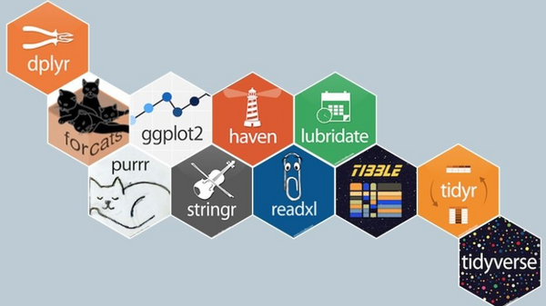

```{r setup, include=FALSE}
knitr::opts_chunk$set(echo = TRUE)
```

# Sesión 2 del Club de R para RRHH

## Temas de hoy

* Librería googlesheets4
* El paquete y filosofía Tidyverse
* Uniendo tablas mediante left_join


# El paquete googlesheets4

El paquete *googlesheets4* nos permite trabajar con planillas de cálculo de Google. Otro paquete que es un buen complemento cuando trabajamos con planillas en español es la librería *gargle* que nos permite trabajar con las "ñ" o las vocales con tilde sin problemas.

Se instalan como cualquier otro paquete:
```{r eval = FALSE}
install.packages("googlesheets4")
install.packages("gargle")
```

Una vez instaladas, cargamos ambas librerías junto con *tidyverse* para poder realizar las transformaciones y limpiezas de datos.
```{r echo=TRUE, message=FALSE}
library(googlesheets4)
library(gargle)
library(tidyverse)
```

Carguemos un dataframe y asignémoslo a un objeto llamado **nomina**. La primera vez que lo usemos nos puede pedir que nos logueemos dandole a R autorización para acceder a los archivos en Google Drive.
```{r echo=TRUE, warning=FALSE, message=FALSE}
nomina <- read_sheet("1UliFjEjab9skkSGp_QVYv3ZQc132dqBLV-97vppQtAg")
```

Antes de avanzar, ¿de dónde sale lo que ponemos dentro de **read_sheet()**? Esto sale de la url de la hoja de cálculo.

> https://docs.google.com/spreadsheets/d/1UliFjEjab9skkSGp_QVYv3ZQc132dqBLV-97vppQtAg/edit#gid=0

Si copiaras y pegaras esa url en tu navegador accederías a la planilla de cálculo con los datos de la nomina.

Toda esta esta parte de la url (1UliFjEjab9skkSGp_QVYv3ZQc132dqBLV-97vppQtAg) representa el ID de la hoja de cálculo, y eso es lo que ponemos dentro de la función **sheets_read()**. O sea que cuando uses una hoja de cálculo de Google tené en cuenta que el ID se encuentra dentro de la url.

> https://docs.google.com/spreadsheets/d/**SPREADSHEET_ID**/edit#gid=SHEET_ID

Si pasamos la función únicamente con el ID de la hoja de cálculo, R va a traer los datos de la primera pestaña del archivo. Si queremos traer los datos de la pestaña 2, podemos usar el parámetro *sheet = 2*, o bien con el nombre *sheet = "Puestos"*
```{r}
puestos <- read_sheet("1UliFjEjab9skkSGp_QVYv3ZQc132dqBLV-97vppQtAg", sheet = "Puestos")
```


### Alternativa

Otra opción para cargar un archivo desde Google Drive es con el paquete *googledrive*.

```{r googledrive, echo=TRUE, warning=FALSE}
library(googledrive)

nomina2 <- drive_get("Nomina") %>%
  read_sheet()
```


## Analizando los datos de nómina

Lo primero que debemos hacer es analizar el dataset, y lo podemos hacer con la función *glimpse*
```{r echo=TRUE}
glimpse(nomina)
```

Con esta función vemos que este dataframe tiene `r nrow(nomina)` filas y `r ncol(nomina)` variables. También podemos ver el tipo de variable en cada columna, y diferenciar cuáles son variables de texto, y cuáles son numéricas.

Con la variable **ID_CAT** hay una complicación. Como las categorías en esta empresa se identifican tanto con números como con letras, R interpretó a esta variable como una *lista* que tiene un tratamiento difernte a los dataframes. Para simplificar nuestro trabajo debemos deshacer la lista con la función **unlist()**.
```{r}
nomina$ID_CAT <- unlist(nomina$ID_CAT)

glimpse(nomina)
```

Luego de ejecutar nuevamente la función **glimpse** podemos ver que ID_CAT ahora es una variable tipo **chr**.


# El paquete Tidyverse



Tidyverse es un conjunto de paquetes destinados a la manipulación y transformación de datos, que van desde la selección, filtrado y creado de variables, hasta la gestión de variables factor (**forcats**), limpieza de texto (**stringr**), y para trabajar con fechas(**lubridate**).

A su vez, Tidyverse se ha convertido poco a poco en un estándar para la manipulación y limpieza de datos (lo que se conoce como **tidydata**) en primer lugar por el abanico de soluciones que abarcan los paquetes y porque las funciones son muy intuitivas, y es fácil encadenarlas entre sí.

Al igual que el resto de los paquetes, hay que instalarlo primero, y luego se carga:
```{r eval=FALSE}
install.packages("tidyverse")
```
```{r}
library(tidyverse)
```

Hay que recordar que para instalar un paquete hay que escribir su nombre entre comillas, y que éstas no son necesarias cuando se cargan. Si es muy importante respetar mayúsculas y minúsculas porque R es **case sensitive**.

## El paquete dplyr

*dplyr* es un paquete que cuenta con una serie de funciones, (también conocidos como **verbos**), que justamente lo que permiten es filtrar, elegir, agrupar, y agregar columnas, entre otras funciones.

Pero antes de meternos en el detalle de este paquete hay que presentar el *símbolo pipe: %>%*.

## El símbolo %>% (pipe)

Una de las cosas más útiles de dplyr es el símbolo *%>%* (pipe en inglés, o tubo) que hace mucho más fácil interpretar y encadenar funciones. Usando el archivo de nómina, supongamos que necesito ver los empleados que tienen hijos de cada área de la empresa, ordenados por área.

Si lo pongo como una serie de fórmulas encadenadas, quedaría algo así:
```{r}
arrange(filter(select(nomina, AREA,ID, HIJOS), HIJOS > 0), AREA)
```

¿Podrías identificar qué parámetro pertenece a cada función? En este caso es medio sencillo, pero si estuviéramos agregando columnas, agrupándolas, y haciendo cálculos probablemente no sería tan fácil.

Otra opción es hacerlo por pasos, creando un objeto por cada paso. Fijénse que en cada paso voy creando un objeto, lo cual no es muy eficiente porque vamos llenando  el ambiente de objetos, y esto implica un consumo de recursos de la máquina, que pueden hacer todo más lento.
```{r}
seleccion_1 <- select(nomina, AREA, ID, HIJOS)
seleccion_2 <- filter(seleccion_1, HIJOS > 0)
arrange(seleccion_2, AREA)
```

Ahora veamos como trabajar con el *%>%* (un atajo de teclado es usando Ctrl+Shift+M).
```{r}
nomina %>%
  select(AREA, ID, HIJOS) %>%
  filter(HIJOS>0) %>%
  arrange(AREA)
```

El **pipe** lo que le dice a R es que tome el objeto o función que está en la primera línea de código y lo pase a la siguiente línea para procesar. De esta manera lo que estamos diciendo es que:

1. Cargue el dataframe **nomina**.
2. Seleccione las columnas **AREA, ID** e **HIJOS**.
3. Filtre los empleados que tienen hijos (o sea, cantidad de hijos mayor que cero).
4. Ordenar los resultados por **AREA**.

Comparen las tres opciones para llegar al mismo resultado y evalúen cuál les resulta más fácil de interpretar. Otra cosa importante para resaltar es que para llegar al mismo resultado, de alguna manera lo programamos en etapas pero sin crear objetos, lo cual es una opción mucho más eficiente. Esta misma selección a su vez la puedo asignar a un objeto.

```{r}
hijos <- nomina %>%
  select(AREA, ID, HIJOS) %>%
  filter(HIJOS>0) %>%
  arrange(AREA)
```


Para los que no estamos acostumbrados a programar, esta forma de trabajar con el símbolo **%>%**, sumado a que los nombres de las funciones son intuitivos nos facilita mucho el aprendizaje. Pensemos por ejemplo cuando hacemos funciones condicionales anidadas en Excel; rastrear qué condición pertenece a cada fórmula anidada es complejo, especialmente cuando nosostros no escribimos esas funciones.

Estas razones explican en parte por qué **tidyverse** se convirtió en un estándar en la manipulación de datos. Además, estos paquetes son desarrollados en su mayoría por los desarrolladores de RStudio, con lo cual cuentan con un mantenimiento y actualización permanente.

# Los verbos de dplyr


## La función select()

Con *select()* elegimos las columnas (variables) con las que queremos trabajar. También nos permite traer las columnas en el orden que las necesitemos.

```{r}
nomina %>%
  select(AREA, ID, HIJOS) %>%
  head()
```

Tanto **select** como otros verbos de tidyverse tienen algunas variantes como por ejemplo *select_if*:
```{r}
nomina %>%
  select_if(is.numeric) %>%
  head()
```

La función **select_if** lo que hace es seleccionar las variables que cumplan con una condición, en el ejemplo anterior, es seleccionar las columnas que son numéricas.

Como mencionaba anteriormente, **select** permite elegir el orden en que aparezcan las columnas. Entonces imaginemos que quiero ver el dataset (o una selección), en donde primero tenga el área, y luego el resto de las columnas. En vez de poner todos los nombres de las variables una por una, podemos usar la función *everything()*.
```{r}
nomina %>%
  select(AREA, everything())
```

## La función filter()

La función *filter()* lo que hace es elegir las observaciones que cumplan con las condiciones que establecemos en el filtro.

Por ejemplo, quienes son los empleados que tienen hijos (que cumplen con la condición que cantidad de hijos sea mayor a cero)
```{r}
nomina %>%
  filter(HIJOS > 0)
```


Algo muy útil para trabajar con **filter()** son los operadores relacionales, y los operadores lógicos.
```{r echo = FALSE}
simbolo <- c("<", "<=", ">", ">=", "==", "!=")
interpretacion <- c("Menor que", "Menor o igual", "Mayor que", "Mayor o igual", "Igual que", "No es igual que")
operadores <- data.frame(simbolo, interpretacion)
knitr::kable(
  head(operadores), caption = "Operadores relacionales", booktabs = TRUE
)
```


Los operadores lógicos que más utilizaremos son:

* x **&** y, representa la condición **AND** (y), o sea que la observación debe cumplir con las dos condiciones (cumplir con la condición x **y** cumplir con la condición y).
* x **|** y, representa la condición **OR** (o), o sea que la observación debe cumplir con al menos una de las dos condiciones (cumplir con la condición x **o** cumplir con la condición y).

Veamos algunos ejemplos:

Quiero obtener una lista con los empleados del sector **INSERTOS** *y* que tengan **menos de un año de ANTIGUEDAD**:
```{r}
nomina %>%
  filter(AREA == "INSERTOS" & ANTIGUEDAD < 1)
```

El símbolo *&* puede ser reemplazado por una coma (,) y obtenemos el mismo resultado.
```{r}
nomina %>%
  filter(AREA == "INSERTOS" , ANTIGUEDAD < 1)
```

Ahora bien, si yo quiero un listado con los empleados de RRHH y de FINANZAS no puedo usar el operador *&*. Veamos por qué.
```{r}
nomina %>%
  filter(AREA == "FINANZAS" & AREA == "RRHH")
```

El resultado es una tibble con 0 observaciones y `r ncol(nomina)` variables. ¿Por qué ocurrió esto? Porque en nuestra base de datos, ninguna persona está registrada en el área de Finanzas y en el de RRHH al mismo tiempo. 

Para que R nos traiga los datos que necesitamos le tenemos que pedir los empleados que estén registrados en el área de FINANZAS *o* en el área de RRHH con el símbolo *|*.
```{r}
nomina %>%
  filter(AREA == "FINANZAS" | AREA == "RRHH")
```

Otra forma de hacer lo mismo es pasando un vector anteponiendo *%in%*. Es mucho más prolijo de hecho porque no tenemos que repetir **AREA**. Las comillas en el vector son importantes.
```{r}
nomina %>%
  filter(AREA %in% c("FINANZAS", "RRHH"))
```

También podemos usar el operador *!=* para filtrar las observaciones que no sean igual a la condición. Por ejemplo, si quiero todos los empleados *excepto* los del área de LAMINADO, el código sería el siguiente:
```{r}
nomina %>%
  filter(AREA != "LAMINADO")
```

En esta empresa, los operarios, que reciben un jornal por las horas que trabajan, sus categorías se identifican con números, mientras que el resto de los empleados, perciben un sueldo mensual (les llamaremos mensuales). Así que si quiero una tabla que sólo contenga a los empleados mensualizados, tendría que filtrar aquellos trabajadores **cuyo ID_CAT sea distinto de 1, 2, 3, 4, o 5**.

Nuevamente, anteponiendo el símbolo *!* logramos este objetivo.
```{r}
mensuales <- nomina %>%
  filter(!ID_CAT %in% c("1", "2", "3", "4", "5"))
head(mensuales)
```
De esta manera ya tengo en el objeto **mensuales** un tibble (o dataframe) con los `r nrow(mensuales)` empleados mensualizados.

## La función arrange()

La función *arrange()* nos permite ordenar la selección que hagamos de acuerdo al parámetro que le indiquemos. Por default, el orden que hace es **ascendente** de menor a mayor.

Por ejemplo, quiero ver los empleados ordenados por edad:
```{r}
nomina %>%
  select(AREA, ID, EDAD) %>%
  arrange(EDAD)
```

También permite ordenar por variables de texto.
```{r}
nomina %>%
  select(AREA, ID) %>%
  arrange(AREA)
```

Si necesitamos ordenar los resultados **descendentemente** (de mayor a menor) hay dos formas de hacerlo. Uno es con la función *desc()*.
```{r}
nomina %>%
  select(AREA, ID, ANTIGUEDAD) %>%
  arrange(desc(ANTIGUEDAD))
```

La otra forma de hacerlo poniendo un símbolo *-* (menos) delante del criterio a ordenar.

```{r}
nomina %>%
  select(AREA, ID, ANTIGUEDAD) %>%
  arrange(-ANTIGUEDAD)
```

## Las funciones group_by() y summarise()

El verbo *group_by* lo usamos para agrupar un dataframe de acuerdo a los valores de una o varias columnas. Por ejemplo, esto lo usamos cuando queremos calcular por ejemplo los sueldos promedios por área.

Por otra parte, *summarise()*, que se suele usar frecuentemente combinado con *group_by()*. Lo que hace *summarise()* es **agregar** una columna a la selección que hicimos, que contiene una medida de resumen estadístico. Por ejemplo, calculemos la antigüedad promedio **agrupada** por área.
```{r}
nomina %>%
  select(AREA, ANTIGUEDAD) %>%
  group_by(AREA) %>%
  summarise(Antiguedad_Promedio = mean(ANTIGUEDAD))
```

En *group_by()* ponemos los nombres de las variables por las que vamos a agrupar los resultados. Dentro de *summarise* primero ponemos el nombre que va a tener la columna que creamos, y luego hacemos el cálculo que necesitamos hacer.

## La función mutate()

La función *mutate()* se usa para crear una nueva columna, a partir de las columnas que ya existen, o directamente una columna nueva.

Por ejemplo,creemos una columna nueva que calcule la diferencia entre la edad y la edad promedio de la empresa
```{r}
nomina %>%
  select(ID, EDAD) %>%
  mutate(Diferencia_Edad = EDAD - mean(EDAD))
```
Por si se lo preguntan, el promedio de edad es de `r round(mean(nomina$EDAD),1)` años. 

También se suele usar a *mutate* para cambiar el tipo de dato que contiene una columna. Por ejemplo, cambiemos **ID_CAT** de **chr** a **fct** (factor).
```{r}
nomina <- nomina %>%
  mutate(ID_CAT = factor(ID_CAT))
head(nomina)
```
Ahora podemos ver que **ID_CAT** es una variable de tipo **fct**.


## La función rename()

La función *rename()* la usamos para cambiar los nombres de las variables. A veces cuando cargamos una tabla de una base de datos del sistema de gestión que tenemos en la empresa, las tablas y sus columnas vienen con nombres abreviados o codificados, lo cual de cara a nuestro interlocutor puede ser un problema si no sabe qué significa esa nomenclatura.

Tomemos por caso nuestra tabla de ejemplo. Veamos los nombres de todas las variables
```{r}
names(nomina)
```

La última columna, **N_CATEG**, que contiene el nombre de la categoría es un ejemplo del problema que mencionamos. Si bien se puede llegar a entender por contexto qué significa ese nombre, sería mejor si llamamos a esa variable **Categoría** directamente.

```{r}
nomina <- nomina %>%
  rename(CATEGORIA = N_CATEG)
```

Puede ser un poco contraintuitivo poner primero el nuevo nombre de la variable y después el original. Pero si prestamos atención al resto de los verbos de **dply**, en especial a **summarise** y a **mutate**, donde primero se pone el nombre de la variable y después el cálculo, puede que explique ésta lógica de **rename**.

## Como usar los verbos en la práctica

[Ben Teusch](https://www.linkedin.com/in/teuschb/), en un curso de análisis exploratorio en R de Datacamp recomendaba una secuencia de pasos que para empezar puede ser una gran guía.

1. Agrupar los grupos que quiero comparar (group_by)
2. Calcular medidas de resumen estadístico (summarise, mutate)
3. Graficar los resultados (ggplot)


# Uniendo tablas

Si bien existen distintas formas de combinar tablas (left_join, right_join, full_join), lo más usual en nuestro campo es usar *left_join()*, que de alguna manera cumple el mismo rol que la funcion **vlookup** o **buscarv** de Excel.

Nuestra tabla *nomina* por ejemplo no tiene los sueldos, ni tampoco los puestos de cada uno de los empleados (solo tiene las categorías). Echemos un vistazo al dataframe *puestos*.
```{r}
glimpse(puestos)
```

Tanto **nomina** como **puestos** comparten una variable en común que es el **ID** del empleado. La forma de unir ambas tablas es la siguiente:
```{r}
nomina_nueva <- left_join(nomina, puestos, by = "ID")
```

La primera tabla, **nomina** es con la que estamos trabajando y que está a la izquierda (de ahí el left_join), **puestos** es la otra tabla que contiene la información con la que me interesa traer. El parámetro **by** le indica a la función por cual columna debe buscar las observaciones.

Cuando las columnas de ambas tablas se llaman igual y *son las únicas columnas que tienen el mismo nombre* podemos omitir el parámetro **by** y R nos dice qué columna usó para unir ambas tablas.

```{r}
nomina_nueva <- left_join(nomina, puestos)
```

Y por supuesto, también lo podemos hacer al estilo **"tidy"**.
```{r}
nomina_nueva <- nomina %>%
  left_join(puestos, by = "ID")
```

Ahora que tenemos una tabla que incluye los sueldos, echemos un vistazo a la misma:
```{r}
glimpse(nomina_nueva)
```

Podemos ver que hay algunas filas que contienen datos nulos, que en R se simbolizan con *NA*, así que vamos a tener que filtrarlos. Sigamos la secuencia de Ben Teusch para hacer un gráfico con los sueldos promedios de cada área.

1. Seleccionar y Agrupar
2. Resumir
3. Graficar

```{r}
nomina_nueva %>%
  select(AREA, PUESTO, SUELDO) %>%
  filter(!is.na(PUESTO)) %>% # !is.na devuelve los valores que no son neutros de la variable puesto.
  group_by(AREA) %>%
  summarise(Sueldo_Promedio = mean(SUELDO)) %>%
  ggplot(aes(x = AREA, y = Sueldo_Promedio)) +
  geom_col() 
```

Perfecto... bueno no... Tenemos el gráfico que queríamos, pero no se puede ver a qué área pertenece cada columna. Además, si bien podríamos ver cuál es el sueldo más alto, es una buena práctica cuando las variables del eje X no son ordinales, ordenar las columnas de mayor a menor. Tampoco está bueno que aparezca **Sueldo_Promedio** con el guión bajo, y combinando mayúsculas y minúsculas cuando el eje **AREA** está escrito todo en mayúsculas (necesitamos consistencia).

Mejoremos este gráfico, rotándolo con *coord_flip()* para hacer legibles los nombres de las áreas, y cambiemos el orden de las columnas con la función *reorder()*.

```{r}
nomina_nueva %>%
  select(AREA, PUESTO, SUELDO) %>%
  filter(!is.na(PUESTO)) %>% # !is.na devuelve los valores que no son neutros de la variable puesto.
  group_by(AREA) %>%
  summarise(Sueldo_Promedio = mean(SUELDO)) %>%
  ggplot(aes(x = reorder(AREA, Sueldo_Promedio), y = Sueldo_Promedio)) +
  geom_col() +
  coord_flip() +
  labs(title = "Sueldo promedio por área",
       x = "",
       y = "")
```


Con esto terminamos la sesión 2, así que probá practicando haciendo distintos grupos y tipos de gráficos.

Algunos análisis de ejemplo:

* Sueldo promedio por puesto
* Crear rangos de edad con *case_when()* y calcular el sueldo promedio.
* ¿En qué puestos hay una mayor diferencia entre el sueldo máximo y el mínimo?


