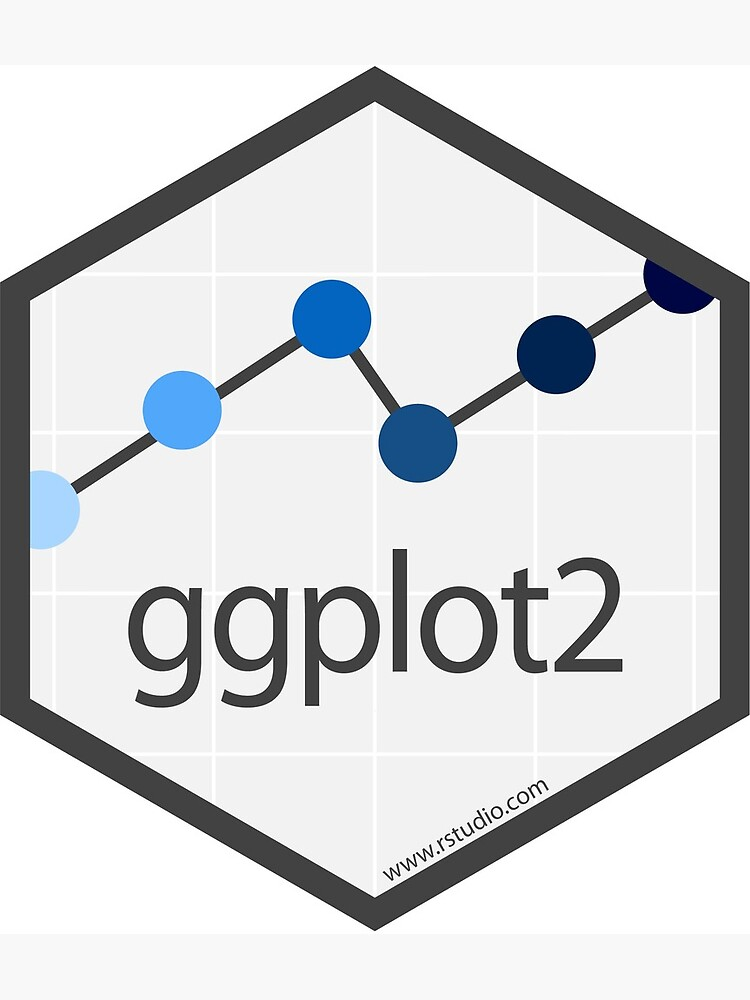
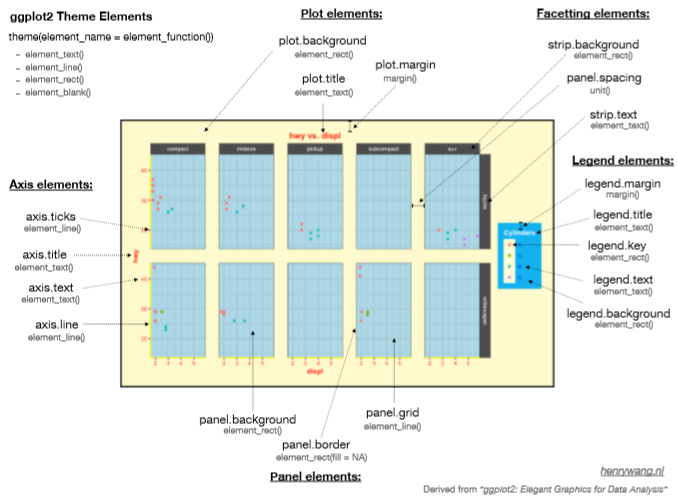
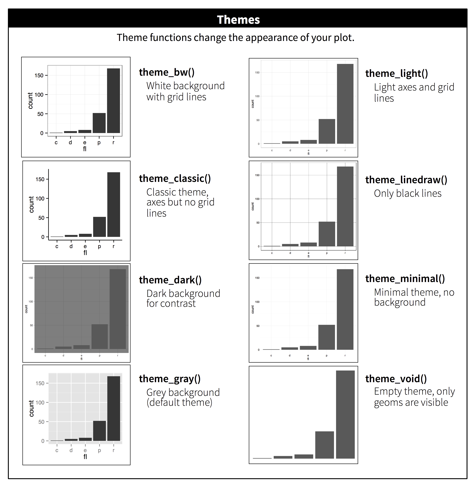

class: inverse, top, center
background-image: url(Archivos/CLUB_DE_R_Linkedin.png)

# Sesión 4 - Tuneando gráficos con ggplot2


```{r setup, include=FALSE}
options(htmltools.dir.version = FALSE)
```


---
class: inverse, middle, right

### Contacto


`r icon::fa("linkedin-in")` [Sergio Garcia Mora](https://www.linkedin.com/in/sergiogarciamora/)

`r icon::fa("twitter")` [sergiogarciamor](https://twitter.com/sergiogarciamor)

`r icon::fa("link")` [Información del Club de R para RRHH](https://data-4hr.com/2020/04/29/club-de-r/)

---

class: left, top



# Haciendo gráficos lindos con ggplot2    

Una de las enormes ventajas que tiene ggplot2 es que se puede literalmente controlar todos los aspectos de un gráfico. [Pablo Tiscornia](https://twitter.com/pabblo_h/status/1261037901007204361?s=20) compartió esta imagen hace poco que ilustra muy bien esto.



---

# Temas

ggplot2 contiene un abanico de *temas* que permiten modificar los estilos de los gráficos con sólo una línea de código. Estos son los temas que complementan al estilo por default:

* theme_bw(): Usa un fondo blando y líneas grises delgadas.
* theme_linedraw(): un tema con sólo líneas negras sobre fondo blanco.
* theme_light(): simiar a linedraw pero con líneas grises claros que permite enfocar la atención en los datos.
* theme_dark(): el primo oscuro de theme_ligth con fondo oscuro que permite que resalten los colores.
* theme_minimal(): como el nombre lo sugiere, una estética minimalista.
* theme_classic(): solo contiene las líneas de los ejes.
* theme_void(): un tema que únicamente grafica los datos.

---

# Temas

Así se ven cada uno de los temas.



---

# Extensiones de ggplot2

Dentro del universo de R hay mucha gente desarrollando paquetes que permiten ampliar el potencial de este lenguaje. Una muestra de esto son las 72 extensiones que podemos encontrar en [esta página](https://exts.ggplot2.tidyverse.org/gallery/).

Algunas sólo modifican la apariencia, otras permiten animar los gráficos, y también hay paquetes que facilitan la visualización de modelos estadísticos.

Uno de los paquetes más utilizados es **ggthemes** que amplía la cantidad de estilos (fondos, y líneas) y también la paleta de colores, para que emulen por ejemplo al diario **The Economist**. También tiene una paleta diseñada para los daltónicos así pueden identificar las diferencias de color.

Usemos algunos datos de la sesión pasada.

---

### Datos

```{r datos, message = FALSE, warning=FALSE}
library(googlesheets4) 
library(gargle)
library(tidyverse)

nomina <- sheets_read("1UliFjEjab9skkSGp_QVYv3ZQc132dqBLV-97vppQtAg")
puestos <- sheets_read("1UliFjEjab9skkSGp_QVYv3ZQc132dqBLV-97vppQtAg", sheet = "Puestos")

mensuales <- nomina %>%
  mutate(ID_CAT = unlist(ID_CAT),
         ID_CAT = as.factor(ID_CAT)) %>%
  filter(!ID_CAT %in% c("1", "2", "3", "4", "5")) %>%
  left_join(puestos, by = "ID") %>%
  mutate(Rangos_Edad = case_when(
    EDAD %in% 18:30 ~ "Hasta 30",
    EDAD %in% 31:40 ~ "Entre 31 y 40",
    EDAD %in% 41:50 ~ "Entre 41 y 50",
    EDAD %in% 51:70 ~ "Más de 50"),
    Rangos_Edad = factor(Rangos_Edad, levels = c("Hasta 30", "Entre 31 y 40",
                                                 "Entre 41 y 50", "Más de 50")))
```

---

### Datos

Vamos a crear un objeto con los sueldos promedio por puesto.
```{r}
sueldos <- mensuales %>%
  group_by(PUESTO) %>%
  summarise(Sueldo_Promedio = mean(SUELDO))
```

También vamos a crear un objeto con la primera línea de un gráfico así nos ahorramos tiempo y código. 
```{r}
grafico <- ggplot(sueldos, aes(x = reorder(PUESTO, -Sueldo_Promedio), y = Sueldo_Promedio))
```

Ahora para hacer un gráfico sólo tenemos que agregar el tipo de gráfico que queremos.
```{r out.width = "70%", fig.align="center"}
grafico + geom_col()
```

---

# Modificando temas con ggthemes

Como con todos los paquetes, primero hay que instalarlo como con todos los paquetes:
```{r eval = FALSE}
install.packages("ggthemes")
```

Y luego lo podemos cargar para usar como cualquier otro paquete:
```{r out.width="40%", fig.align="center"}
library(ggthemes)

grafico + geom_col()+
  theme_economist() # Uno de los temas de ggthemes
```

---

# Daltonismo

ggthemes además tiene funciones para que los gráficos tengan colores apropiados para daltónicos]

```{r color-blind, fig.show= 'hide'}
# Gráfico con los colores por default
grafico + geom_col(aes(fill = PUESTO))

# Gráfico con paleta apta para daltónicos
grafico + geom_col(aes(fill = PUESTO)) +
  scale_fill_colorblind()
```

```{r ref.label = 'color-blind', echo=FALSE, message=FALSE, warning=FALSE, out.widht="50%"}
```


---

# Texto

El texto es una parte importante de los gráficos. Un buen título permite saber de qué se trata un gráfico, y limpiar la "tinta" redundante de un gráfico.

--

También hay que prestar atención a los ejes. Por ejemplo en el gráfico que venimos utilizando, es imposible leer los títulos de los puestos porque son muy largos.

--

Otro problema que tenemos es el monto que aparece en el eje *y*. Tenemos que poner atención en el gráfico para poder ver los miles. Eso es algo que podemos corregir fácilmente. **Todo lo que hagamos para facilitar la lectura y comprensión del gráfico hace a su buena calidad.**

--

Veamos como podemos mejorar esto.

---

# Títulos

Hay varias formas de cambiar el título de un gráfico. Por ejemplo, podemos usar **ggtitle** o **labs**, y **xlab** o **ylab** para modificar los nombres de los ejes (labels en inglés)

```{r fig.asp=0.7, fig.align='center'}
grafico + geom_col() + 
  ggtitle("Sueldo promedio por puesto") + 
  xlab("Puestos") +
  ylab("Sueldo Promedio")
```

---

# Títulos

La función *labs* por otra parte tiene varios parámetros que permiten escribir además del título, **subtítulos**, **caption**, modificar los ejes.

```{r fig.asp=0.7, fig.align='center'}
grafico + geom_col() + 
  labs(title = "Sueldo promedio por puesto",
       subtitle = "FY 16",
       x = "Puesto", 
       y = "Sueldo Promedio",
       caption = "En AR$")
```

---

# Texto de los ejes
## Etiquetas largas

.left[Hay varias formas de poder hacer legibles las etiquetas de un eje cuando los nombres son largos. Una forma es modificando el ángulo de las etiquetas]

.pull-left[
```{r ejes1, fig.show= 'hide'}
grafico + geom_col()+
  ggtitle("Sueldo promedio por puesto")+
  theme(axis.text.x = element_text(angle = 90))
```
]

.pull-right[
```{r ref.label = 'ejes1', echo=FALSE, message=FALSE, warning=FALSE}
```
]

---

# Texto de los ejes
## Etiquetas largas

.left[Otra forma de solucionar este problema es con una nueva función introducida en la versión 3.3.0 de ggplot que es **guide_axis** que permite especificar la cantidad de renglones para las etiquetas.]

.pull-left[
```{r ejes2, fig.show= 'hide'}
grafico + geom_col()+
  ggtitle("Sueldo promedio por puesto") +
  scale_x_discrete(guide = guide_axis(n.dodge = 2))
```
]

.pull-right[
```{r ref.label = 'ejes2', echo=FALSE, message=FALSE, warning=FALSE}
```
]

---

# Texto de los ejes
## Etiquetas largas

.left[Por último, algo que también podemos hacer es rotar los gráficos con coord_flip().]

.pull-left[
```{r ejes3, fig.show= 'hide'}
grafico + geom_col()+
  ggtitle("Sueldo promedio por puesto") +
  coord_flip()
```
]

.pull-right[
```{r ref.label = 'ejes3', echo=FALSE, message=FALSE, warning=FALSE}
```
]

---

# Texto de los ejes.
# Separadores de miles

.left[Cuando tenemos un eje con sueldos en este caso, poner los puntos (o las comas) para separar identificar los miles, hace que el gráfico sea más prolijo, facilitando la lectura. Esto lo podemos lograr con la función **scale_y_continuos** y **comma_format** del paquete **scales**.]

.pull-left[
```{r millar, fig.show='hide', message=FALSE}
library(scales)

grafico + geom_col()+
  ggtitle("Sueldo promedio por puesto")+
  scale_y_continuous(labels = comma_format(big.mark = ".", decimal.mark = ","))
```
]

.pull-right[
```{r ref.label= 'millar', message=FALSE, warning=FALSE, echo=FALSE}
```
]

---

# Texto en el gráfico

.left[Otra cosa que podemos hacer es incluir el valor dentro del gráfico. Eso nos pemite eliminar las etiquetas del eje y (en este caso) que brindan información redundante.]

.pull-left[
```{r geom_text, fig.show='hide'}
grafico + geom_col()+
  geom_text(aes(label=round(Sueldo_Promedio),
                hjust=-0.2))+
  scale_y_continuous(limits = c(0,100000))+
  labs(x="",y="")+
  ggtitle("Sueldo promedio por puesto")+
  coord_flip()
```

]

.pull-right[
```{r ref.label= 'geom_text', message=FALSE, warning=FALSE, echo=FALSE}
```
]

---

# Colores

.left[Los colores de un gráfico los podemos modificar por ejemplo con atributos del objeto, dentro del aes()]

.pull-left[
```{r color1, fig.show='hide'}
grafico + geom_col(aes(fill=PUESTO))+
  scale_y_continuous(labels = comma_format(big.mark = ".", decimal.mark = ","))+
  labs(x="",y="")+
  ggtitle("Sueldo promedio por puesto")+
  coord_flip()
```

]

.pull-right[
```{r ref.label= 'color1', message=FALSE, warning=FALSE, echo=FALSE}
```
]

---

# Colores

.left[Veamos qué pasa cuando uso el parámetro color con un gráfico de barras]

.pull-left[
```{r color2, fig.show='hide'}
grafico + geom_col(aes(color=PUESTO))+
  scale_y_continuous(labels = comma_format(big.mark = ".", decimal.mark = ","))+
  labs(x="",y="")+
  ggtitle("Sueldo promedio por puesto")+
  coord_flip()
```

]

.pull-right[
```{r ref.label= 'color2', message=FALSE, warning=FALSE, echo=FALSE}
```
]

---

# Colores

.left[Si quiero que las barras tengan un color específico, no lo puedo pasar dentro del aes() porque recordemos que dentro del aes() mapeamos las variables del dataframe.]

.pull-left[
```{r color3, fig.show='hide'}
grafico + geom_col(aes(fill="blue"))+
  scale_y_continuous(labels = comma_format(big.mark = ".", decimal.mark = ","))+
  labs(x="",y="")+
  ggtitle("Sueldo promedio por puesto")+
  coord_flip()
```

]

.pull-right[
```{r ref.label= 'color3', message=FALSE, warning=FALSE, echo=FALSE}
```
]

---

# Colores

.left[Para usar un color específico lo puedo pasar fuera del mapeo de variables]

.pull-left[
```{r color4, fig.show='hide'}
grafico + geom_col(fill="blue", colour = "yellow")+
  scale_y_continuous(labels = comma_format(big.mark = ".", decimal.mark = ","))+
  labs(x="",y="")+
  ggtitle("Sueldo promedio por puesto")+
  coord_flip()
```

]

.pull-right[
```{r ref.label= 'color4', message=FALSE, warning=FALSE, echo=FALSE}
```
]

---

# Colores

.left[También podemos usar paletas de colores de paquetes como **RColorBrewer** por ejemplo.]

.pull-left[
```{r color5, fig.show='hide', message=FALSE}
library(RColorBrewer)

grafico + geom_col(aes(fill=PUESTO))+
  scale_fill_brewer(palette = "PuOr")+
  scale_y_continuous(labels = comma_format(big.mark = ".", decimal.mark = ","))+
  labs(x="",y="")+
  ggtitle("Sueldo promedio por puesto")+
  coord_flip()
```

]

.pull-right[
```{r ref.label= 'color5', message=FALSE, warning=FALSE, echo=FALSE}
```
]

---

# Colores

.left[Podemos jugar con los gradientes también, pasando al parámetro **fill** una variable numérica.]

.pull-left[
```{r color6, fig.show='hide', message=FALSE}
grafico + geom_col(aes(fill=Sueldo_Promedio))+
  scale_fill_gradient(low = "orange", high = "blue")+
  scale_y_continuous(labels = comma_format(big.mark = ".", decimal.mark = ","))+
  labs(x="",y="")+
  ggtitle("Sueldo promedio por puesto")+coord_flip()
```

]

.pull-right[
```{r ref.label= 'color6', message=FALSE, warning=FALSE, echo=FALSE}
```
]

---

# Agregar líneas de referencia a los gráficos

.left[En los gráficos podemos agregar líneas de referencia para mostrar promedios, objetivos, o un antes o después en algún período de tiempo. Las funciones **geom_vline** y **geom_hline** permiten agregar líneas que atraviesen los ejes x e y respectivamente.]

.pull-left[
```{r linea, fig.show='hide', message=FALSE}
grafico + geom_col(fill="#5DADE2")+
  scale_y_continuous(labels = comma_format(big.mark = ".", decimal.mark = ","))+
  labs(x="",y="")+
  ggtitle("Sueldo promedio por puesto")+
  geom_hline(yintercept = mean(sueldos$Sueldo_Promedio),
             color = "red",
             linetype = 2)+
  theme(axis.text.x = element_text(angle = 90))
```
]

.pull-right[
```{r ref.label= 'linea', message=FALSE, warning=FALSE, echo=FALSE}
```
]

---
class: inverse, center, middle

# FUENTES

---

## Fuentes de consulta

Hadley Wickham - Elegant graphics for data analysis

### Texto en los gráficos

https://www.r-graph-gallery.com/275-add-text-labels-with-ggplot2.html

https://ggplot2.tidyverse.org/reference/geom_text.html

https://cmdlinetips.com/2020/03/ggplot2-2-3-0-is-here-two-new-features-you-must-know/

https://statisticsglobe.com/change-formatting-of-numbers-of-ggplot2-plot-axis-in-r

### Colores

http://www.cookbook-r.com/Graphs/Colors_(ggplot2)/


---
class: inverse, center, bottom

Presentación realizada con el paquete [Xaringan](https://github.com/yihui/xaringan) desarrollado por Yihui Xie.
Gracias a [Patricia Loto](https://twitter.com/patriloto) por compartir el [tutorial](https://twitter.com/patriloto/status/1260822644590608391?s=20)
