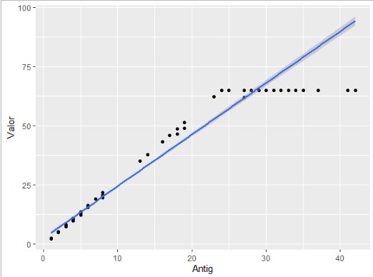
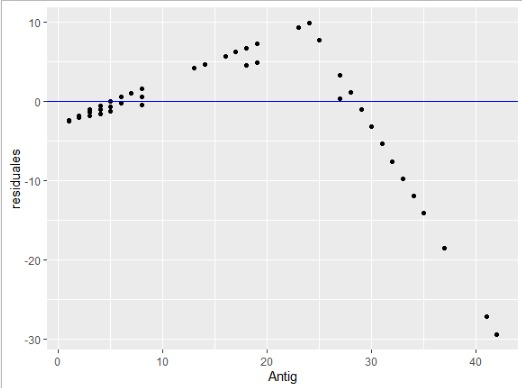

class: inverse, top, center
background-image: url(Archivos/CLUB_DE_R_Linkedin.png)

# Sesión 6 - Estadística y regresiones lineales


```{r setup, include=FALSE}
options(htmltools.dir.version = FALSE)
```


---
class: inverse, middle, right

### Contacto


`r icon::fa("linkedin-in")` [Sergio Garcia Mora](https://www.linkedin.com/in/sergiogarciamora/)

`r icon::fa("twitter")` [sergiogarciamor](https://twitter.com/sergiogarciamor)

`r icon::fa("link")`[Información del Club de R para RRHH](https://data-4hr.com/2020/04/29/club-de-r/)

---

# Estadística en Analytics

Si bien el análisis estadístico es una parte de un proyecto de People Analytics, es imposible disociar la estadística de Analytics, aunque más no sea para hablar de promedios. Lo cual es todo un desafío, porque al menos en Relaciones del Trabajo de la UBA, el principal factor por la cual los estudiantes eligen la carrera es porque:

--

> **No tiene números**

--

El segundo factor es para ayudar a la gente.

---

## El problema es que no te entiendo

Uno de los problemas en la enseñanza de la estadística (y de la matemática) es que lo suelen enseñar especialistas que aprendieron de especialistas, y que están acostumbrados a enseñar a gente que está familiarizada con la simbología y terminología de la disciplina.

--


---

# Una que sepamos todos: el promedio

```{r echo = FALSE, message=FALSE, warning=FALSE}
library(googlesheets4)
library(tidyverse)

edades <- read_sheet("1A5zzDcQm86h9B4Jet3niS-4v3iubsFHk1l3TM5zGths", range = "A1:B12")

promedio_edad <- round(mean(edades$Edad),1)
```

Algo que todos sabemos calcular es el promedio:

--

<br>


--

<br>
Como cuenta [Walter Sosa Escudero](https://www.linkedin.com/in/walter-sosa-escudero-a23454110/) en su libro ["Big Data: breve manual para conocer la ciencia de datos que ya invadió nuestras vidas"](http://www.sigloxxieditores.com.ar/fichaLibro.php?libro=978-987-629-899-5), el *promedio* es una medida de *tendencia central*. Esto quiere decir que es el valor más representativo de un conjuno de números. Por ejemplo la edad promedio de los participantes del *Club de R para RRHH* es de `r promedio_edad` años.

---

# Una que sepamos todos: el promedio

```{r promedio, fig.align='center', fig.height=4.5}
ggplot(edades, aes(x = Edad, y = Inicial, label = Inicial))+
  geom_point() + labs(y="")+
  geom_text(nudge_x = 0.3, nudge_y = 0.3) +
  geom_vline(xintercept = promedio_edad, color = "red", size = 1.2, alpha = 0.5)
```

Algo importante en estadística es el tema de las distancias. Una característica del promedio es que la suma de las distancias de cada uno de los puntos al promedio es la más chica posible.

---

# Un lugar para cada cosa, y cada cosa en su lugar: la mediana y los cuartiles.

Así como el promedio es una medida de *tendencia central*, la **mediana** y los **cuartiles** son medidas **de orden**. Lo que hacen estas medidas es ordenar los datos de mayor a menor, y nos indican cuál es el valor que está en:

--

* El valor correspondiente al 25% de los datos: Primer cuartil

--

* El valor correspondiente al 50% de los datos: La mediana (el segundo cuartil)

--

* El valor correspondiente al 75% de los datos: Tercer cuartil.


---

# Un lugar para cada cosa, y cada cosa en su lugar: la mediana y los cuartiles.

¿Qué esto de los cuartiles? Hablando mal y pronto, supongamos que nuestro jefe nos dice que pongamos 100 carpetas en 4 cajas, ordenadas alfabéticamente, y que cada caja tiene que tener exactamente la misma cantidad de carpetas.

En la primera caja vamos a poner 1/4 de las carpetas, en la segunda las carpetas correspondientes al 2/4 (la mitad) de las carpetas, en la tercera caja vamos a tener guardadas 3/4 de las carpetas, y en la última caja vamos a poner las carpetas finales.

--

.center[]

---

# Un lugar para cada cosa, y cada cosa en su lugar: la mediana.

En R podemos ver todas estas medidas con la función **summary**:
```{r}
summary(edades$Edad)
```

---

# Varianza y desvío estándar

La **varianza** y el **desvío estándar** son medidas de dispersión. Es decir que su propósito es calcular qué tan desparramados los datos en relación a una referencia.

Esto es algo importante a tener en cuenta cuando usamos los promedios. Porque no es lo mismo hablar sobre sueldos promedios cuando los sueldos *están cerca* del promedio, que cuando hay una dispersión importante.

```{r warning = FALSE, message = FALSE}
hr_data <- read.csv("HRDataset_v13.csv")
hr_data$Department <- factor(hr_data$Department)    

hr_data %>%
  filter(Department %in% c("IT/IS", "Production       ", "Sales")) %>%
  group_by(Department) %>%
  summarise(Promedio = mean(PayRate), 
            Desvio = sd(PayRate))
```


---

```{r fig.align='center', fig.height=4.5, fig.retina=3}
hr_data %>%
  filter(Department %in% c("IT/IS", "Production       ", "Sales"), !is.na(PayRate)) %>%
  ggplot(aes(Department, PayRate, color = Department))+
  geom_point(alpha = 0.3, size = 3)
```

---

```{r fig.align='center', fig.height=4.5, fig.retina=3}
hr_data %>%
  filter(Department %in% c("IT/IS", "Production       ", "Sales"), !is.na(PayRate)) %>%
  ggplot(aes(Department, PayRate, fill = Department))+
  geom_boxplot()
```


---

class: inverse, center
background-image: url(Archivos/causation.jpg)


# Correlación

---

# Correlación

La **correlación** nos indica la relación entre dos variables y *qué tan fuerte* es esa relación. El resultado de una correlación siempre va a ser un resultado entre **`-1`** y **`1`**, donde:

* -1 Es una correlación perfecta **negativa**
* 0 No hay correlación
* 1 Es una correlación perfecta **positiva**

Una correlación *negativa* implica que cuando una variable sube, la otra variable baja. Y cuando la correlación es *positiva* cuando una variable sube, la otra también.

---

# Correlación

Vamos a crear dos data frames:

```{r}
p<- c(25,22,20,16,12,8,5,3,18,23,13,9,23,8,2)
a<- c(3,5,8,12,16,20,22,25,7,6,15,18,7,19,23)
dfn <- data.frame(a, p)

r <- c(1,2,3,4,5,6,7,8,9,10)
sesiones <- c(1,2,3,4,5,6,7,8,9,10)
dfp <- data.frame(r, sesiones)
```

---

# Correlación


Ahora veamos como quedan los gráficos:
```{r correlaciones, fig.show='hide', message=FALSE, warning=FALSE}
ggplot(dfn, aes(p, a))+ ggtitle("Correlación negativa")+ 
  geom_point(size = 3) + geom_smooth(method = "lm", se = F)
ggplot(dfp, aes(sesiones, r))+
  geom_point(size = 3) + geom_smooth(method = "lm", se = F)+
  ggtitle("Cuanto saben de R los participantes del Club de R")
```

```{r fig.retina=3, out.width = "45%",ref.label= 'correlaciones', message=FALSE, warning=FALSE, echo=FALSE}
```

---

# Correlación

Para calcular una correlación en R, es muy simple, sólo hay que usar la función `cor`.

```{r}
cor(dfn$p, dfn$a)
```

La fuerza de una correlación depende del dominio, no es lo mismo la importancia de la correlación en ingeniería mecánica que en ciencias sociales, pero una guía más o menos acertada sería la siguiente:

```{r echo = FALSE, message=FALSE, warning=FALSE}
library(kableExtra)
Rango <- c("De 0,7 a 1", "Entre 0,5 a 0,7", "Entre 0,3 a 0,5", "Entre 0 y 0,3")
Correlación <- c("De fuerte a total", "De moderada a fuerte", "De débil a moderada", "De nula a débil")
tabla1 <- as_tibble(data.frame(Rango, Correlación))

knitr::kable(tabla1, format = "markdown", align = "c") %>% 
  kable_styling(bootstrap_options = "stripped",full_width = FALSE) %>%
  footnote(general = "Fuente: Ciencia de Datos para Gente Sociable")
```

---

class: inverse, center
background-image: url(Archivos/regresion_lineal.jpg)


---

# Regresión Lineal

La **regresión lineal** es uno de los algoritmos más elementales para predecir **valores**. Hay muchos tipos de regresiones que abordan distintos tipos de problemáticas. Pero la regresión lineal lo que permite hacer es estimar el valor de una variable en función de las relaciones entre las variables.

Una de las cosas que tenemos que tener bien en claro con las regresiones lineales es que el resultado va a ser un **número**. Por ejemplo:

--

* El gasto promedio *en función* de los ingresos.

--

* El sueldo *en función* de los años de experiencia.

--

Una obviedad: La regresión lineal se representa con una línea que atraviesa los puntos, que como cuenta Walter Sosa Escudero, tiene la característica de ser una recta que pasa lo más cerca posible de todos los datos.

---

# Regresión Lineal
## Quedando bien con alguien que sabe matemática

Vamos a hacer un gráfico con un eje vertical y un eje horizontal en donde los puntos van a representar a los datos. La recta que representa a la *regresión lineal simple* en algún momento va a "cortar" con el eje vertical (cuando x es igual a 0), y tiene un ángulo.

--

La función de una recta es:

$$y = a + bx$$

--

Y si hablan con un nerd, le pueden decir que:

* **a** representa al *coeficiente de intercepción* (donde la recta corta al eje y)
* **bx** representa a la *pendiente* de la recta

En donde el resultado de `y` va a depender de los resultados de `x`.

--

... en una regresión lineal simple.

---

# Regresión Lineal Simple

En una regresión lineal simple lo que vamos a intentar hacer es predecir el valor de `y` analizando su relación con una sola variable. En otras palabras, vamos a tratar de explicar como aumenta (o baja) una variable en relación con otra variable.

Esto en lenguaje nerd se dice:

> *Estimar la variable dependiente (y) en función de la variable explicatoria (x)*

--

Pero para entender esto, vamos a necesitar datos... sí... de la encuesta de sueldos de Sysarmy.

---

### Los datos

```{r cache=TRUE, warning=FALSE, message=FALSE}
library(googlesheets4)
library(gargle)
library(tidyverse)
library(scales)

gs4_deauth()
options(scipen = 999) # Cambia la notación científica de los gráficos
encuesta_sysarmy <- sheets_read("1_db6zEAMvr-1GQjJb4hV-rSQfJ9w6GmezbqKJ2JJn7I", skip = 9)

analisis <- encuesta_sysarmy %>%
  select('Trabajo de','Me identifico', `Salario mensual BRUTO (en tu moneda local)`, 'Años de experiencia', "Cantidad de empleados") %>%
  rename(Genero = 'Me identifico', 
         Puesto = 'Trabajo de',
         Sueldo_Bruto = `Salario mensual BRUTO (en tu moneda local)`,
         Experiencia = 'Años de experiencia',
         Empleados = 'Cantidad de empleados') %>%
  filter(!is.na(Empleados),
         Puesto %in% c("Developer", "QA / Tester"),
         between(Sueldo_Bruto, 20000, 1000000),
         Genero != "Otros",
         ) %>%
  mutate(Experiencia = as.numeric(unlist(Experiencia)),
    Empleados = factor(Empleados, levels = c("1-10","11-50","51-100","101-200","201-500",
                                                  "501-1000","1001-2000","2001-5000",
                                                  "5001-10000")),
    Genero = factor(Genero),
    Puesto = factor(Puesto))
```

---

### Los datos
 Creemos dos objetos para analizar a los *QA* y a los *Developers*.
 
```{r}
qa <- analisis %>%
  filter(Puesto == "QA / Tester")

developer <- analisis %>%
  filter(Puesto == "Developer")
```
 

---

# Regresión lineal simple

Vamos a ver primero la relación entre el Sueldo Bruto y los años de experiencia. Repasando: queremos analizar cuánto influyen los años de experiencia en el sueldo. Para esto vamos a usar la función `lm` (por *lineal model*).

```{r}
mod_qa <- lm(Sueldo_Bruto ~ Experiencia, data= qa)

mod_qa
```
```{r echo = FALSE, message=FALSE, warning=FALSE}
library(broom)

qa_inter <- unlist(tidy(mod_qa)[1,2])
qa_coef <- unlist(tidy(mod_qa)[2,2])

```


¿Qué es esto? Primero vemos el *intercept*, es decir que cuando x es igual a 0, la recta pasa por el eje vertical en `r scales::comma(qa_inter)`. 

--

El siguiente valor, lo que nos está diciendo que por cada año de experiencia adicional, el sueldo bruto *sube* `r scales::comma(qa_coef)` pesos.


---

# Regresión lineal simple
 
 
.pull-left[Con lo que aprendimos veamos un gráfico.
```{r reg1, fig.show='hide', message=FALSE, warning=FALSE}
analisis %>%
  filter(Puesto == "QA / Tester") %>%
  ggplot(aes(Experiencia, Sueldo_Bruto))+
  geom_point(alpha = 0.3, size = 2)+
  geom_smooth(method = "lm")+
  scale_y_continuous(labels = scales::comma_format(big.mark = ".", decimal.mark = ","))
```
]

.pull-right[
```{r ref.label='reg1', echo = FALSE, message=FALSE, warning=FALSE, fig.retina=3}

```
]


---

# Regresión lineal simple
## Análisis de Residuales

Así como es muy sencillo calcular una regresión y visualizarla, también es muy fácil malinterpretar las relaciones.

Hay varios análisis que se pueden hacer, incluyendo test de normalidad, de varianza de los errores, por ejemplo, pero mínimamente deberíamos hacer un análisis de los **residuales**.

--

Los residuales son los "errores observados", y de alguna manera representan a la distancia entre el dato, y la recta de regresión.

--

Dentro de las cosas que tenemos que observar de los residuales son:

* Que la distribución de los errores sea normal y sin outliers
* Que un gráfico de residuales no presente ningún patrón.

---

# Regresión lineal simple
## Análisis de Residuales

Usemos la librería `broom` para analizar algunos valores.
```{r}
library(broom)

head(augment(mod_qa),3)
```

Por suerte el primer registro tiene 0 años de experiencia. Nuestro cálculo decía que si la experiencia era igual a 0, el sueldo estimado (en la columna *fitted*) debería ser `46.637`, sin embargo la observación esa persona cobra `40.000`. Entonces el residual es `-6.337`.

---

# Regresión lineal simple
## Análisis de Residuales

Para calcular los residuales podemos usar la función `residuals` en nuestro modelo.

```{r}
qa_residuos <- residuals(mod_qa)
```

Estos residuales se los podemos añadir al objeto *qa* para poder hacer unos gráficos.

```{r}
qa <- qa %>% mutate(Residuos = qa_residuos)
head(qa, 3)
```

---

# Regresión lineal simple
## Análisis de Residuales

.pull-left[
```{r resid1, fig.show='hide'}
ggplot(qa, aes(Residuos))+
  geom_density()
```

Podemos determinar que la distribución es bastante normal.
]

.pull-right[
```{r ref.label="resid1", echo = FALSE, message=FALSE, warning=FALSE, fig.retina=3}

```
]

---

# Regresión lineal simple
## Análisis de Residuales

.pull-left[También hay que observar que los residuales no tengan ningún patrón visible.
```{r resid2, fig.show='hide'}
ggplot(qa, aes(Experiencia, Residuos))+
  geom_point(alpha = 0.4)+
  scale_y_continuous(labels = scales::comma_format(big.mark = ".", decimal.mark = ","))
```

]

.pull-right[
```{r ref.label="resid2", echo = FALSE, message=FALSE, warning=FALSE, fig.retina=3}

```
]

---

# Regresión lineal simple
## Análisis de Residuales para Valientes

Al principio decíamos que en estadística las distancias, las posiciones relativas de los datos es algo muy importante. Esto en parte explica como podemos relacionar una variable como los años, que va del 0 al 30 aproximadamente, con otra variable que está expresada en decenas de miles.

Por ejemplo, una de estas referencias es la recta de regresión, y los residuales son una forma de ver qué tan lejos o cerca está el dato de dicha recta. Pero, con las magnitudes tal como están es difícil ver esa distancia.

--

Algo que nos ayuda a ver mejor esta relación es la **estandarización** o **normalización** de los datos. Lo que hace esto es transformar los datos para ver su valor relativo al promedio.


---

# Regresión lineal simple
## Análisis de Residuales para Valientes

Para *estandarizar* los residuos, vamos a necesitar la librería `clusterSim` y al igual que lo que hicimos con los residuos, los agregamos al objeto `qa`.

--

```{r message=FALSE, warning = FALSE}
library(clusterSim)
qa_res_nor <- data.Normalization (residuals(mod_qa), type = "n1", normalization = "file" )

qa <- qa %>% mutate(res_nor = qa_res_nor)
head(qa, 3)
```

---

# Regresión lineal simple
## Análisis de Residuales para Valientes

.pull-left[
```{r resnorm, warning=FALSE, message=FALSE, fig.show='hide'}
ggplot(qa, aes(Experiencia, res_nor))+
  geom_point()+
  geom_hline(yintercept = 0, color = "red")+
  geom_hline(yintercept = 2, color = "red", linetype = 2)+
  geom_hline(yintercept = -2, color = "red", linetype = 2)
```

En este caso tenemos la mayoría de las observaciones dentro del rango +2 y -2, que es lo que buscamos cuando estandarizamos los residuales.
]

.pull-right[
```{r ref.label="resnorm", echo=FALSE, warning=FALSE, message=FALSE, fig.retina=3}

```

]

---

# Regresión lineal simple
## Análisis de Residuales 

¿Cómo se vería un gráfico de residuales anómalo? Por ejemplo, algo así.

.pull.left[

]

.pull-right[

]

---

# Regresión lineal múltiple

¿Qué pasa si agregamos otra variable al modelo, por ejemplo el género? El cálculo es facilísimo.

```{r}
qa_rlm <- lm(Sueldo_Bruto~Experiencia+Genero, data = qa)
qa_rlm
```

---

# Regresión lineal múltiple

.pull-left[Veamos gráficamente las distribuciones por género
```{r rlm, message=FALSE, warning=FALSE, fig.show='hide'}
library(ggthemes)
ggplot(qa, aes(Experiencia, Sueldo_Bruto, color = Genero ))+
  geom_point(alpha = 0.4, size = 2.5)+
  geom_smooth(method = "lm", se = FALSE)+
  scale_color_colorblind()+
  scale_y_continuous(labels = scales::comma_format(big.mark = ".", decimal.mark = ","))
```

]

.pull-right[
```{r ref.label="rlm", echo=FALSE, warning=FALSE,message=FALSE, fig.retina=3}

```

]

---

# Regresión lineal múltiple

¿Cómo se interpretan todos estos resultados? Vamos a usar el paquete `moderndive` para ayudarnos con esto.
```{r}
library(moderndive)

get_regression_table(qa_rlm)

```

Como *hombre* alfabéticamente está antes que *mujer*, el coeficiente de intercepción va a corresponder al sueldo de los hombres. Ya este dato sólo nos arroja que el sueldo de los hombres cuando la experiencia es igual a 0, es de casi $ 2.000 más.

---
class: inverse, center, middle

# DESAFIOS

---

## Desafíos

1. Repetir los ejercicios para los *Developers* e interpretar los resultados.
2. Aplicar una regresion lineal simple a datos que tengamos, y hacer un análisis de residuales.


---
class: inverse, center, middle

# FUENTES

---

## Fuentes de consulta

Walter Sosa Escudero: ["Big data: breve manual para entender la ciencia de datos que ya invadió nuestras vidas"](http://www.sigloxxieditores.com.ar/fichaLibro.php?libro=978-987-629-899-5)

Antonio Vazquez Brust, Libro: [Ciencia de datos para gente sociable - Cap. 5](https://bitsandbricks.github.io/ciencia_de_datos_gente_sociable/modelado-estad%C3%ADstico.html)


[Data Modeling with moderndive](https://moderndive.com/5-regression.html)


### Estandarizar variables

https://stackoverrun.com/es/q/4126411


---
class: inverse, center, bottom

Presentación realizada con el paquete [Xaringan](https://github.com/yihui/xaringan) desarrollado por Yihui Xie.
Gracias a [Patricia Loto](https://twitter.com/patriloto) por compartir el [tutorial](https://twitter.com/patriloto/status/1260822644590608391?s=20)
