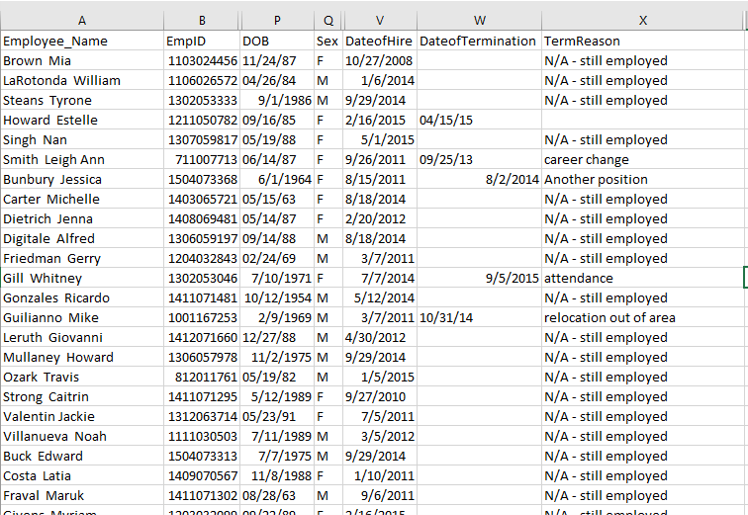
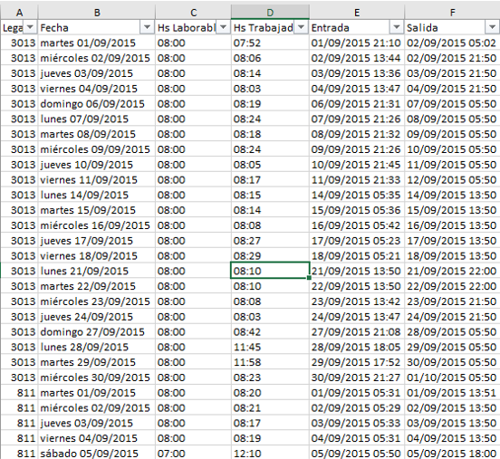

class: inverse, top, center
background-image: url(Archivos/CLUB_DE_R_Linkedin.png)

# Sesión 27 - Trabajar con fechas y horas


```{r setup, include=FALSE}
options(htmltools.dir.version = FALSE)
knitr::opts_chunk$set(echo = TRUE, message=FALSE, warning=FALSE, dpi=300)
```


---
class: inverse, middle, right

### Contacto


`r icon::fa("linkedin-in")` [Sergio Garcia Mora](https://www.linkedin.com/in/sergiogarciamora/)

`r icon::fa("twitter")` [Redes Sociales](https://linktr.ee/r4hrclub)

`r icon::fa("link")` [Información del Club de R para RRHH](https://r4hr.club)

---
class: inverse, middle, center

# Trabajar con fechas y horas


---
# Trabajar con fechas y horas


Trabajar con fechas y horas es una de las cosas más difíciles con cualquier software. La complejidad surge porque hay que combinar dos fenómenos **físicos**: la rotación y la traslación del planeta, con otros fenómenos **geopolíticos** como la definición de los meses, horarios de verano, de invierno, etc..

--

Sumemosle a eso las distintas convenciones para las fechas.

--

* Argentina: 16/08/1979
* USA: 08/16/1979
* ISO 8.601: 1979-08-16

Y algo similar pasa con las horas.

R usa este último formato
```{r}
lubridate::today()
```


---
# Lubridate

`lubridate` es el paquete desarrollado por Garrett Grolemund y Hadley Wickham para trabajar con fechas y horas. El cheatsheet en español [lo descargan aquí](https://github.com/rstudio/cheatsheets/raw/master/translations/spanish/lubridate-Spanish-translation-2019.pdf).

Como todos los paquetes la forma de instalarlo y de cargarlo es:

```{r eval=FALSE}
install.packages("lubridate") # Para instalar el paquete
library(lubridate)            # Para cargarlo

```

Vamos a repasar el capítulo 16 del libro **[R para Ciencia de Datos](https://es.r4ds.hadley.nz/fechas-y-horas.html)**. 
.right[

]
---
# Lubridate
## Reconociendo fechas

.pull-left[El paquete `lubridate` puede reconocer todas estas variantes de fechas:
```{r ejemplo-fechas, results='hide'}
library(lubridate)

d1 <- "Enero 1, 2010"
d2 <- "2015-Mar-07"
d3 <- "06-Jun-2017"
d4 <- c("Agosto 19 (2015)", "Julio 1 (2015)")
d5 <- "12/30/14" # Diciembre 30, 2014

```
]

.pull-right[
```{r}
mdy(d1)
ymd(d2)
dmy(d3)
mdy(d4)
mdy(d5)
```

]

---
# Creando fechas y horas

Hay tres tipos de fechas/horas para mostrar tiempo.

* Una fecha o `date`. Un *tibble* lo imprime como `<date>`.
* Una hora o `time` dentro de un día. Los tibbles lo imprimen como `<time>`.
* Una fecha-hora, o `date-time` es una fecha con una hora adjunta, que refleja un momento preciso con formato de *fecha, horas, minutos* y *segundos*. Los tibbles lo imprimen como `<dttm>`. En R base a este formato lo identifican como POSIXct.

--

En la medida de lo posible hay que usar el formato más simple que podamos usar.

---
# Los datasets
# HRDataset y fichadas

Vamos a trabajar con dos datasets, uno que ya conocemos, el `HRDataset_v13.csv` y uno de `fichadas.xlsx` para trabajar con horas.

.pull-left[

]

.pull-right[

]
---
# Carguemos los datasets

```{r datos, message=FALSE, warning=FALSE}
library(tidyverse)
library(readr)
library(openxlsx)
library(lubridate)

# Cargamos 1er dataset
hr_data <- read_delim("Datasets/HRDataset_v13.csv", delim = ";")

#Nos quedamos sólo con algunos campos
hr_data <- hr_data %>% 
  select(EmpID, Sex, DOB, DateofHire, DateofTermination)

# Cargamos 2do dataset
fichadas <- read.xlsx("Datasets/fichadas.xlsx")
```

---
# HRDataset

Veamos qué contiene este dataframe en las primeras filas

```{r explo-hrdataset}
head(hr_data)
```

¿Qué formato tienen los campos de fecha?

--

Mes - Día - Año

---
#HRDataset

¿Qué tipos de datos tiene este dataframe?
```{r}
glimpse(hr_data)
```

--

Los campos que contienen fechas ahora son campos de tipo `character`, así que tenemos que pasarlos a variables de tipo `date`.

---
#HRDataset

.pull-left[Para pasar las variables que contienen fechas de `character` a `date` podemos usar la vieja y conocida función `mutate` y usando la función `mdy()` para indicar que primero viene el mes, luego el día, y finalmente el año.

```{r}
hr_data <- hr_data %>% 
  mutate(DOB = mdy(DOB),
         DateofHire = mdy(DateofHire),
         DateofTermination = mdy(DateofTermination))
```
]

.pull-right[
```{r}
glimpse(hr_data)
```

]

---
# HRDataset

`lubridate` tiene varias funciones para extraer información de los campos de tipo `date`.
```{r funciones-basicas}
(ejemplo <- pull(hr_data[1,3]))

year(ejemplo)
month(ejemplo)
wday(ejemplo, label = TRUE)

```

---
## Obteniendo los componentes

Las funciones de `lubridate` que permiten descomponer los elementos de una fecha son:

--

* `year()` para obtener el año.
* `month()` para obtener el mes.
* `mday()` para obtener el *día del mes*. Por ej.: `mday(ejemplo)` es igual a `r mday(ejemplo)`.
* `yday()` para obtener el *día del año*. Por ej.: `yday(ejemplo)` es igual a `r yday(ejemplo)`.
* `wday()` para obtener el *día de la semana*.
* `hour()` para obtener la hora.
* `minute()` para obtener el minuto.
* `second()` para obtener el segundo.

Tanto `month()` como `wday()` permiten configurar el parámetro `label = TRUE` para obtener el nombre abreviado del mes o del día respectivamente. También cuenta con el parámetro `abbr = FALSE` para retornar el nombre completo.

Por ej.: `month(ejemplo, label = TRUE, abbr = FALSE)` arroja como resultado `r month(ejemplo, label = TRUE, abbr = FALSE)`.

---
# HRDataset

Ahora podemos usar estas funciones para hacer análisis y gráficos.

.pull-left[
```{r line-plot, fig.show='hide'}
hr_data %>% 
  mutate(anio = year(DateofHire),     # Crea un campo extrayendo el año de 'DateofHire'
         cuenta = 1) %>%              # Agrega una columna con un 1 en cada fila
  group_by(anio) %>%                  # Agrupa por año
  summarise(total = sum(cuenta)) %>%  # Suma el total de contrataciones por año
  ggplot(aes(x = anio, y = total)) +  # Hago un gráfico de líneas
  geom_line() +
  labs(title = "Contrataciones por año",
         x = "", y = "") 
```

]

.pull-right[
```{r ref.label="line-plot", echo = FALSE}

```

]

---
# HRDataset
# ¿Qué pasó acá?

El gráfico anterior falló por dos motivos (asumo yo):

--

1. Por más que `anio` muestra sólo el año, asumo que internamente contiene toda la información de la fecha.

--

2. R siempre trata de distribuir los ejes equitativamente, por eso los años aparecen como `2007.5` o `2010.0`.

---
# RDataset
## Corrigiendo el gráfico

.pull-left[
Una función que podemos usar para resolver este problema es `floor_date` que permite redondear el resultado de acuerdo al parámetro que indiquemos.
```{r line2, fig.show='hide'}
hr_data %>% 
  mutate(anio = floor_date(DateofHire, 
                           unit = "year")) %>% # La unidad de redondeo es el año
  group_by(anio) %>% 
  summarise(total = n()) %>% 
  ggplot(aes(x = anio, y = total)) +
  geom_line() +
  labs(title = "Evolución anual de contrataciones",
         x = "", y = "") 
```
]

.pull-right[
```{r ref.label="line2", echo = FALSE}

```
]

---
# HRDataset
## Cálculos con fechas

¿Cuál es la antigüedad promedio de los empleados? ¿Cuál es la antigüedad promedio de la gente que se fue? Preguntas que podemos responder con `lubridate`.

```{r}
hr_data %>% 
  filter(is.na(DateofTermination)) %>% 
  mutate(antiguedad = today() - DateofHire) %>% 
  select(EmpID, DateofHire, antiguedad)
```

---
# HRDataset
## Cálculos con fechas

Obtuvimos un resultado, pero no fue el ideal. Para resolver esto tenemos que usar los **períodos**.
```{r ant_anios_1}
hr_data %>% 
  filter(is.na(DateofTermination)) %>% 
  mutate(antiguedad = as.period(interval(start = DateofHire, end = today())))
```

---
# Fichadas
## Calcular horas trabajadas

Trabajar con horas es un poco más difícil. Primero, hay que tener en cuenta qué tipos de cálculos puede hacer `lubridate`.

1. **Duración**: Es el cálculo más sencillo, y *siempre* va a estar calculado en segundos.

--

2. **Intervalo**: Un intervalo está calculado en segundos también, pero tiene asociada una fecha de inicio. Esto permite calcular el intervalo entre dos momentos específicos de tiempo.

--

3. **Período**: Esto permite calcular tiempo en medidas más grandes como años, meses, días. Lo cual no siempre es sencillo teniendo en cuenta los años bisiestos, o que tenemos meses con 30 días, o meses con 31 días.
---
# HRDataset
## Cálculos con fechas

Anteriormente pudimos obtener un resultado *preciso*, pero un poco incómodo para leer. Podemos extraer el año sólamente.
```{r ant_anios_2}
hr_data %>% 
  filter(is.na(DateofTermination)) %>% 
  mutate(antiguedad = as.period(interval(start = DateofHire, end = today()))$year)
```

---
class: inverse, middle, center
## Fichadas


---
# Fichadas

Este es un archivo que contiene las fichadas de entrada y de salida de empleados del turno mañana. Exploremos el archivo.


```{r}
head(fichadas)
```

---
# Fichadas

Este es un archivo que contiene las fichadas de entrada y de salida de empleados del turno mañana. Exploremos el archivo.


```{r}
glimpse(fichadas)
```


---
# Fichadas

¿Se podrá convertir la columna `Fecha` a tipo `date`? El campo `Hs.Laborables` indica la duración teórica de la jornada, y la columna `Hs.Trabajadas` es el el total de horas trabajadas que sale del sistema. 

Ya que estamos, convirtamos el resto de los campos a `dttm`.

```{r}
fichas <- fichadas %>% 
  mutate(Fecha = dmy(Fecha),
         Entrada = dmy_hm(Entrada),
         Salida = dmy_hm(Salida))
```

--

¿Habrá funcionado la transformación de la columna `Fecha`?

---
#Fichadas

.pull-left[
```{r}
glimpse(fichas)
```
]

.pull-right[
## Great success!!! `r emo::ji("party")`

]


---
# Fichadas
# Cálculo de horas trabajadas

Probemos calcular las horas trabajadas directamente con nuestras columnas `dttm`.

```{r}
fichas %>% 
  mutate(hs_trabajadas = Salida - Entrada) %>% 
  select(Entrada, Salida, hs_trabajadas) %>% 
  head() # Sólo para mostrar 6 filas
```

---
# Fichadas
# Cálculo de horas trabajadas

Para calcular mejor las horas trabajadas tenemos que usar los **intervalos** y los **períodos**.
```{r}
fichas2 <- fichas %>% 
  mutate(intervalo_trabajado = Entrada %--% Salida,         # Crea un intervalo
         horas_trabajadas = as.period(intervalo_trabajado)) # Calcula el tiempo

fichas2 %>% select(intervalo_trabajado, horas_trabajadas) %>% head()
```

---
# Fichadas
# Estructura de los campos de intervalo y período.

Veamos la estructura de los campos `<Interval>` y `<Period>`.

```{r}
fichas2 %>% select(intervalo_trabajado, horas_trabajadas) %>% str()
```

.right[

]

---
# Fichadas
# Haciendo otros análisis

Vamos a crear un objeto para analizar quienes trabajaron menos horas de las que les correspondía trabajar. Así que creamos una columna que contenga un `TRUE` cada vez que la persona no haya completado su jornada de trabajo.

```{r}
fichas3 <- fichas2 %>% 
  mutate(Hs.Laborables = hm(Hs.Laborables),
         vagos = intervalo_trabajado < Hs.Laborables) %>% # Me traicionó el subconsciente
  filter(vagos == 1) %>% 
  select(Fecha, Hs.Laborables, intervalo_trabajado, vagos)

head(fichas)
```

---
# Fichadas
# Haciendo otros análisis

.pull-left[
Y con esta información podemos hacer un gráfico para ver cuál es el día que más se incumplió con la jornada de trabajo.
```{r jor-incum, fig.show='hide'}
fichas3 %>% 
  mutate(dia_semana = wday(Fecha, label = TRUE)) %>% 
  ggplot(aes(x = dia_semana)) +
  geom_bar() + ggtitle("Incumplimiento de la jornada laboral \n por día de la semana")
```

]

.pull-right[
```{r ref.label="jor-incum", echo=FALSE}

```

]
---
# Fuentes

[R para Ciencia de Datos](https://es.r4ds.hadley.nz/) de Garrett Grolemund y Hadley Wickham

[StackOverflow](https://stackoverflow.com/questions/31126726/efficient-and-accurate-age-calculation-in-years-months-or-weeks-in-r-given-b) Consulta sobre cómo calcular la edad.

[Working with dates and time in R using the lubridate package](https://data.library.virginia.edu/working-with-dates-and-time-in-r-using-the-lubridate-package/) University of Virginia Library
---
class: inverse, center, bottom

Presentación realizada con el paquete [Xaringan](https://github.com/yihui/xaringan) desarrollado por Yihui Xie.

Gracias a [Patricia Loto](https://twitter.com/patriloto) por compartir el [tutorial](https://twitter.com/patriloto/status/1260822644590608391?s=20)