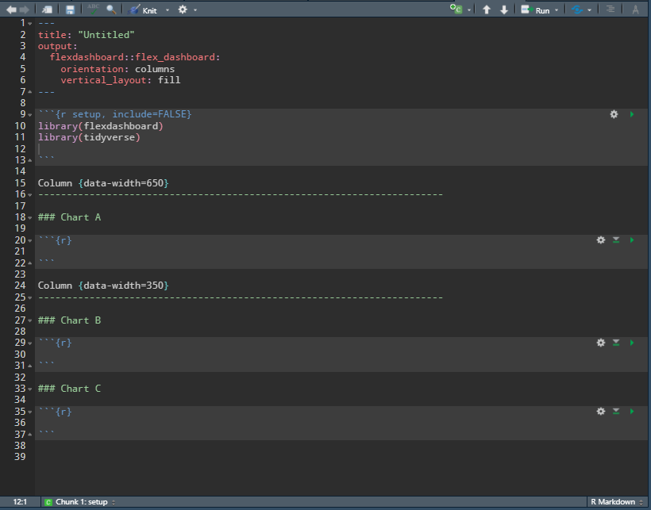

class: inverse, top, center
background-image: url(Archivos/CLUB_DE_R_Linkedin.png)

# Sesión 28 - El paquete flexdashboard


```{r setup, include=FALSE}
options(htmltools.dir.version = FALSE)
knitr::opts_chunk$set(echo = TRUE, message=FALSE, warning=FALSE, dpi=300)
```


---
class: inverse, middle, right

### Contacto


`r icon::fa("linkedin-in")` [Sergio Garcia Mora](https://www.linkedin.com/in/sergiogarciamora/)

`r icon::fa("twitter")` [Redes Sociales](https://linktr.ee/r4hrclub)

`r icon::fa("link")` [Información del Club de R para RRHH](https://r4hr.club)

---
class: middle

.pull-left[
## ¿¿¿¿Tableros hecho en R????
]

--

.pull-right[

]

---
## ¿¿¿¿Tableros hecho en R????
.center[


[Ejemplos](https://rmarkdown.rstudio.com/flexdashboard/examples.html)
]
---
# Flexdashboard
## Tableros en R

Los tableros de comando son una herramienta que permiten resumir mucha informacion y volcarla visualmente en un sólo lugar.

Si bien desde mi punto de vista R no sería mi primera opción para armar un dashboard, una de las ventajas que tiene es la enorme flexibilidad de análisis y de customización, que no está tan limitada como en otras plataformas de BI. Especialmente para hacer cosas que no están nativamente desarrolladas.

--

También puede ser una buena opción por si no hay presupuesto para licencias. Y además la lógica de `flexdashboard` está basada en `RMarkdown`.

---
# Comenzando

Para crear un tablero en `flexdashboard` hay que ir a *File* -> *R Markdown* -> *From Template* -> "Flex dashboard*.

.pull-left[

]

.pull-right[


]

---
# Comenzando
## El script

Los dashboards en R están pensados en filas y en columnas.

.pull-left[


]

.pull-right[


]

---
# Ancho de columnas

Con `flexdashboard` podemos controlar la cantidad de columnas, definiendo su ancho, **y siempre teniendo en cuenta ** que el ancho máximo de la pantalla es de 1000. La suma de todos los anchos de las columnas deben totalizar 1000.


---
# Crear columnas

Para crear columnas hay que usar el separador `(----------------------)` especificando el ancho de la columna.

```{r eval=FALSE}

Column {data-width=600}
-----------------------------------------------

### Gráfico 1

```

---
# Estilos

Estos son los estilos predefinidos de `flexdashboard`

* default
* cosmo
* bootstrap
* cerulean
* journal
* flatly
* readable
* spacelab
* united
* lumen
* paper
* sandstone
* simplex
* yeti


---
# Tablero por filas

Es posible cambiar la configuración por `columnas` a `filas` modificando el encabezado YAML.

Noten que ahora no hace falta especificar el ancho de las columnas.

.center[

]

---
# Tabsets

Los *Tabsets* son pestañas que podemos incorporar a los gráficos para usar por ejemplo para mostrar otro gráfico de los mismos datos.


--

Prueben usar el parámetro `.tabset-fade` dentro de la función.

---
# Páginas

Para crear páginas hay que usar el separador `(==============)`. En cada página podemos tener configuraciones diferentes de layout (por columnas, o por filas).


---
# Menú

Si tenemos un dashboard con muchas pestañas podemos crear menúes que permitan hacer más cortas las listas de pestañas.


---
# Conclusiones

.pull-left[

]

.pull-right[
Si bien lo que vimos es sólo estático, hay muchas posibilidades dinámicas para usar con:

* plotly
* shiny
* leaflet
* y muchos más...

Y no me parece una mala opción para usar frente a otras plataformas de BI
]
---
# Fuentes

[R para Ciencia de Datos](https://es.r4ds.hadley.nz/formatos-de-r-markdown.html#dashboards) de Garrett Grolemund y Hadley Wickham

[Flexdashboard](https://rmarkdown.rstudio.com/flexdashboard/index.html): Documentación y ejemplos

[R Markdown: The Definitive Guide](https://bookdown.org/yihui/rmarkdown/dashboard-components.html#value-boxes): de Yihui Xie, J. J. Allaire, Garrett Grolemund

---
class: inverse, center, bottom

Presentación realizada con el paquete [Xaringan](https://github.com/yihui/xaringan) desarrollado por Yihui Xie.

Gracias a [Patricia Loto](https://twitter.com/patriloto) por compartir el [tutorial](https://twitter.com/patriloto/status/1260822644590608391?s=20)