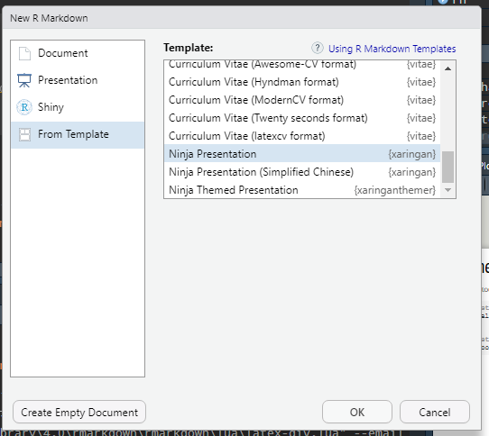
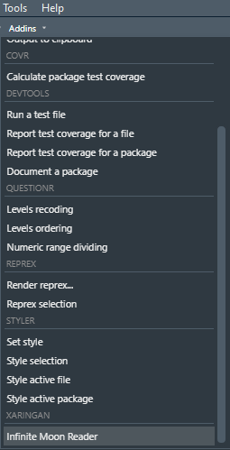
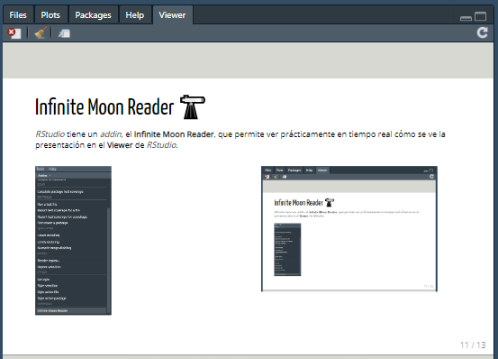
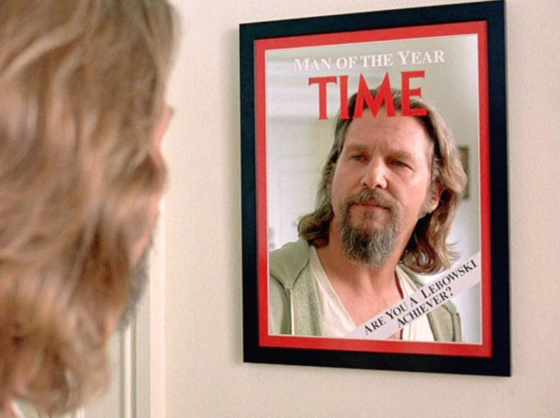

class: inverse, top, center
background-image: url(Archivos/CLUB_DE_R_Linkedin.png)

# Sesión 30 - Presentaciones con Xaringan


```{r setup, include=FALSE}
options(htmltools.dir.version = FALSE)
knitr::opts_chunk$set(echo = TRUE, message=FALSE, warning=FALSE)
```


---
class: inverse, middle, right

### Contacto


`r icon::fa("linkedin-in")` [Sergio Garcia Mora](https://www.linkedin.com/in/sergiogarciamora/)

`r icon::fa("twitter")` [Redes Sociales](https://linktr.ee/r4hrclub)

`r icon::fa("link")` [Información del Club de R para RRHH](https://r4hr.club)

---

# Xaringan
## Ninja Presentation

.right[

]

**Xaringan** es un paquete para hacer presentaciones de HTML5 dentro de R Markdown. 

--

De fondo, usa `remark.js`, una herramienta que combina *JavaScript* y *markdown* para crear presentaciones HTML.

--
#### ¿Por qué usar `Xaringan` si hay otros *templates* nativos de R Markdown? 

Porque permite un mayor control sobre los estilos, ya sea usando R Markdown, CSS, o un poquito de HTML

---
class: inverse
### y porque es imposible hacer esto en otros formatos...

.pull-left[

Tener el código en un lado...
```{r histograma, fig.show='hide', warning=FALSE, message=FALSE}
library(tidyverse)

rh <- read_delim("https://raw.githubusercontent.com/r4hr/club_de_r/master/Datos/encuesta_sueldos.csv", 
                 delim = ",")

ggplot(rh, aes(x = sueldo_bruto)) +
  geom_histogram()

```

]

.pull-right[
... y mostrar los resultados al lado...
```{r ref.label="histograma", echo = FALSE}

```

]

---
class: inverse, center, middle
# Comenzando

<br>


---
# Comenzando

Como todos los paquetes, primero hay que instalarlo.

```{r eval=FALSE}
# instalar xaringan por primera vez
install.packages("xaringan")


# instalarlo desde la página del desarrollador
devtools::install_github("yihui/xaringan")

```

---
# Comenzando

En esencia, voy a estar replicando la [presentación](https://arm.rbind.io/slides/xaringan.html#1) de [Alison Hill](https://twitter.com/apreshill) porque me pareció la más sencilla de seguir.

Para crear una presentación de **Xaringan** hay que crear un documento de `R Markdown`. La secuencia es *File* `r emo::ji("arrow_right")` *R Markdown* `r emo::ji("arrow_right")` *From Template* `r emo::ji("arrow_right")` *Ninja Presentation*.

.pull-left[

]

.pull-right[

]

---
class: inverse, center, middle
# Knit

1. Creen un archivo y luego pulsen el botón **Knit**.
2. Pongan un nombre al archivo, y guárdenlo.

<br>


---
# Infinite Moon Reader `r emo::ji("telescope")`

*RStudio* tiene un *addin*, el **Infinite Moon Reader**, que permite ver prácticamente en tiempo real cómo se ve la presentación en el **Viewer** de *RStudio*. Cada vez que salves el archivo se actualiza el *viewer*.


.pull-left[

]

.pull-right[


]

---
# R Markdown

Las mismas reglas de R Markdown aplican para redactar/crear una presentación en **Xaringan**.

```{r eval=FALSE}
# Esto es un título

## Un título de nivel 2

# The dark side of the moon
## Disco 1
### Lado 1

1. In The Flesh?
2. The Thin Ice
3. Another Brick In The Wall (Part I)
4. The Happiest Days Of Our Lives
5. Another Brick In The Wall (Part II)
6. Mother
```

---
# R Markdown

El código anterior se vería así

--

# Esto es un título

## Un título de nivel 2

# The dark side of the moon
## Disco 1
### Lado 1

1. In The Flesh?
2. The Thin Ice
3. Another Brick In The Wall (Part I)
4. The Happiest Days Of Our Lives
5. Another Brick In The Wall (Part II)
6. Mother

---
# Pasando de slides

El primer slide comienza cuando termina el encabezado YAML.

Para pasar de un slide a otro tenemos que poner tres guiones.

```{r eval=FALSE}

Venimos presentando como un campeón.

---
  
Pasamos a otro slide.
```

---
# Alineando

.pull-left[
### Alineación horizontal
**Posibilidades**

* `left`
* `center`
* `right`


### Alineación Vertical
* `top`
* `middle`
* `bottom`
]

--

.pull-right[

```{r eval=FALSE}

---
class: center, bottom
Zarpale la data


```

Ese código genera este slide:
]


---
class: inverse, right, bottom
Zarpale la data


---
# Columnas laterales

Con las opciones `.left-column[]` y `right-column[]` podemos tener columnas laterales.

.left-column[
## Esto es mucho

## Muy importante
]

.right-column[
La columna de la izquierda es angosta (un 20% de la pantalla), y la columna de la derecha es la principal (75% del slide)

Si tenés varios títulos de nivel 2 (`##`), o de nivel 3 (`###`) en la columna de la izquierda, el último título va a estar resaltado, mientras que los títulos anteriores van a aparecer sombreados.
]

---
# Presentaciones incrementales

Un recurso muy útil en el storytelling con presentaciones es que aparezcan los párrafos secuencialmente, o de manera incremental. Es muy fácil.

--

```{r eval=FALSE}
Un párrafo

--

Otro párrafo
```

--

`r emo::ji("warning")` Es muy importante no dejar espacios después de los dos guiones.

---
# Opciones para alinear contenido

Algunas opciones que podemos usar para controlar la posición de nuesto contenido es mediante CSS.

* `.left[]`
* `.center[]`
* `.right[]`

.left[
### `r emo::ji("see_no_evil")`
`.left[]`
]

.center[
### `r emo::ji("hear_no_evil")`
`.center[]`
]

.right[
### `r emo::ji("speak_no_evil")`
`.right[]`
]

---
class: center, middle
# ¿Cómo se pone el código de un lado y el gráfico del otro lado?


---
# ¿Cómo se pone el código de un lado y el gráfico del otro lado?

El truco es el siguiente: en el primer bloque de código, hay que:

* Ponerle nombre al bloque.
* Usar la opción `fig.show="hide"` para que no muestre el resultado al final del bloque de código.
* Usar las clases de CSS, `.pull-left[]` y `.pull-right[]`

```{r eval=FALSE}
.pull-left[
  Todo el código/texto que va a la izquierda.
]

.pull-right[
  Todo el código/texto que va a la derecha.
]

```

--

Veamos un ejemplo.

---
# Multimedia
## Imágenes

Se pueden cargar imágenes locales y desde internet. Hay dos formas de cargar imágenes.

.pull-left[
### Markdown


``


]

.pull-right[
### HTML

Esta opción permite controlar más parámetros de la imagen, como el tamaño con `width="20%"`, o dónde va a estar alineada con `align="right"` se puede controlar su alineación.



``


]
---
# Multimedia
# Videos

Por ejemplo, desde Youtube, cualquier video público o privado se puede embeber dentro de la presentación.

* Vas al video de Youtube y ponés "Compartir"
* Elegí la opción *"Insertar"*.
* Copiá el código que aparece en Youtube directo en tu slide.
* Listo

.center[
<iframe width="560" height="315" src="https://www.youtube.com/embed/Mz4GbMCqvcY" frameborder="0" allow="accelerometer; autoplay; clipboard-write; encrypted-media; gyroscope; picture-in-picture" allowfullscreen></iframe>
]

---
# Widgets
## Kable

Hay algunos widgets que funcionan bien en Xaringan. Por ejemplo: `kable`,

```{r warning=FALSE, message=FALSE}
knitr::kable(rh %>% 
               select(genero) %>% group_by(genero) %>% tally())
```

--

No se pierdan la clase magistral de [Luis Grau](https://www.linkedin.com/in/luis-grau-r-212b3a9/) sobre como hacer tablas con `kable` en [este link](https://youtu.be/FeIjUw2NuQo).

---

# Widgets
## gt

También podemos meter tablas con el paquete `gt`.

```{r warning=FALSE, message=FALSE}
library(gt)

gt(rh %>% select(genero) %>% group_by(genero) %>% tally())
```

---
## DT

También podemos meter tablas con el paquete `DT`.


```{r warning=FALSE, message=FALSE, out.width="60%"}
library(DT)
rh %>% select(puesto, sueldo_bruto) %>% datatable()
```

---
## leaflet

.left-column[Podemos embeber mapas con el paquete `leaflet`.]

.right-column[

```{r warning=FALSE, message=FALSE,  out.width="60%"}
library(leaflet)
leaflet() %>% addTiles() %>% setView(lat = -34.6204, lng = -58.3867, zoom = 17)
```
]
---
# Gráficos

Hacer gráficos dentro de Xaringan es tán fácil como escribir un bloque de código.

Podemos controlar la calidad de los gráficos con dos opciones que se ponen dentro de la configuración del bloque de código, y son `fig.retina`, y `dpi`.

--

Vamos a crear un gráfico y lo guardamos en un objeto para simplificar los ejemplos.

```{r}
grafico <- rh %>% 
  select(anios_rh, sueldo_bruto) %>%            # Selecciono las columnas a graficar
  filter(anios_rh < 35,                         # Filtro datos con menos de 35 años de exp
         sueldo_bruto < 500000) %>%             # Filtro sueldos menores a $ 500.000
  ggplot(aes(x = anios_rh, y = sueldo_bruto)) + # Asigno las variables a los ejes x e y 
  geom_point(color = "#EC7063",                 # Defino un color    
             alpha = 0.5,                       # Asigno transparencia a los puntos
             size = 3) +                        # Defino el tamaño de los puntos
  # Agrego el título y subtítulo del gráfico
  labs(title = "Relación entre años de experiencia y sueldo bruto",
       subtitle = "En AR$",
       x = "Años en RRHH",
       y = "Sueldo Bruto")+
  theme_minimal() +                            # Modifica apariencia del gráfico
  scale_y_continuous(labels = scales::comma_format(big.mark = ".", decimal.mark = ","))

```
---
## fig.retina

.pull-left[
Este es un gráfico con `fig.retina=1` que es el default.
```{r out.width="90%"}
grafico
```

]

--

.pull-right[
Este es un gráfico con `fig.retina=3`.
```{r fig.retina=3, out.width="90%"}
grafico
```

]


---
## dpi

.pull-left[
Este es un gráfico con `dpi=72` que es el default.
```{r, out.width="90%"}
grafico
```

]

--

.pull-right[
Este es un gráfico con `dpi=300`.
```{r dpi=300, out.width="90%"}
grafico
```

]

---
# Imágenes de fondo

Podemos establecer una imagen de fondo para un slide desde el seteo del slide:

```{r eval=FALSE}

termina un slide

---
background-image: url(Archivos/gghighlight_es.jpg) # Asigna la imagen

```

Luego podemos agregar una opción que puede ser:

--

* `background-size`

** `cover`: que redefine el tamaño de la imagen para cubrir todo el slide.

** `contain`: que modifica el tamaño para que entre en el slide.

---
class: middle, center
background-image: url(Archivos/gghighlight_es.jpg)

### Tamaño de la imagen: 7091 x 4632
---
class: middle, center
background-image: url(Archivos/gghighlight_es.jpg)
background-size: cover

# Cover

---
class: middle, center
background-image: url(Archivos/gghighlight_es.jpg)
background-size: contain

# Contain

---
# Resaltar código

Dentro de Xaringan se puede resaltar código, lo cual es muy útil a la hora de enseñar.

Para eso hay que modificar el encabezado YAML

```{r eval=FALSE}
output:
  xaringan::moon_reader:
    nature:
      highlightLines: true
```

--

Veamos un ejemplo.

---
# Resaltar código

.pull-left[
```{r dispersion, fig.show='hide'}
grafico <- rh %>% 
  select(anios_rh, sueldo_bruto) %>%    
  filter(anios_rh < 35, sueldo_bruto < 500000) %>% 
  ggplot(aes(x = anios_rh, y = sueldo_bruto)) +  
  geom_point(color = "#EC7063",     #<<                
             alpha = 0.5,           #<<            
             size = 3) +            #<<            
  # Agrego el título y subtítulo del gráfico
  labs(title = "Relación entre años de experiencia y sueldo bruto",
       subtitle = "En AR$",
       x = "Años en RRHH",
       y = "Sueldo Bruto") +
 theme_minimal() +                  
  scale_y_continuous(labels = scales::comma_format(big.mark = ".", decimal.mark = ","))
```

]

.pull-right[
```{r ref.label="dispersion", echo=FALSE}

```

]

---
# Estilos

La forma más sencilla de modificar el estilo de una presentación es desde el encabezado, usando las opciones por default de Xaringan.

```{r eval=FALSE}
---
title: "Club de R para RRHH"
output:
  xaringan::moon_reader:
    seal: false
    css: [default, shinobi, tamu-fonts]
    nature:
      ratio: "16:9"
      highlightStyle: github
      highlightLines: true
    language: "spanish"
---
```

---
# Estilos

Estas son todas las opciones diferentes de estilos predefinidos en Xaringan. Hay paquetes como `xaringanthemer` que amplían las posibilidades de estilos, y si no podemos definirlos en un archivo CSS.

```{r}
names(xaringan:::list_css())
```


---
# Fuentes

[Making slides in R Markdown](https://arm.rbind.io/slides/xaringan.html#1) de Alison Hill

[Presentation Ninja](https://slides.yihui.org/xaringan/#1) de Yihui Xie

[R Markdown: The Definitive Guide](https://bookdown.org/yihui/rmarkdown/xaringan.html): de Yihui Xie, J. J. Allaire, Garrett Grolemund

[Sharing your Xaringan Slides](https://www.garrickadenbuie.com/blog/sharing-xaringan-slides/) de Garrick Aden-Buie

[Build presentations in R with Xaringan](https://www.kirenz.com/slides/xaringan-demo-slides.html#1) de Jan Kirenz

---
class: inverse, center, bottom

Presentación realizada con el paquete [Xaringan](https://github.com/yihui/xaringan) desarrollado por Yihui Xie.

Gracias a [Patricia Loto](https://twitter.com/patriloto) por compartir el [tutorial](https://twitter.com/patriloto/status/1260822644590608391?s=20)