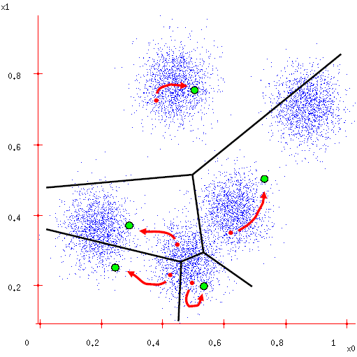
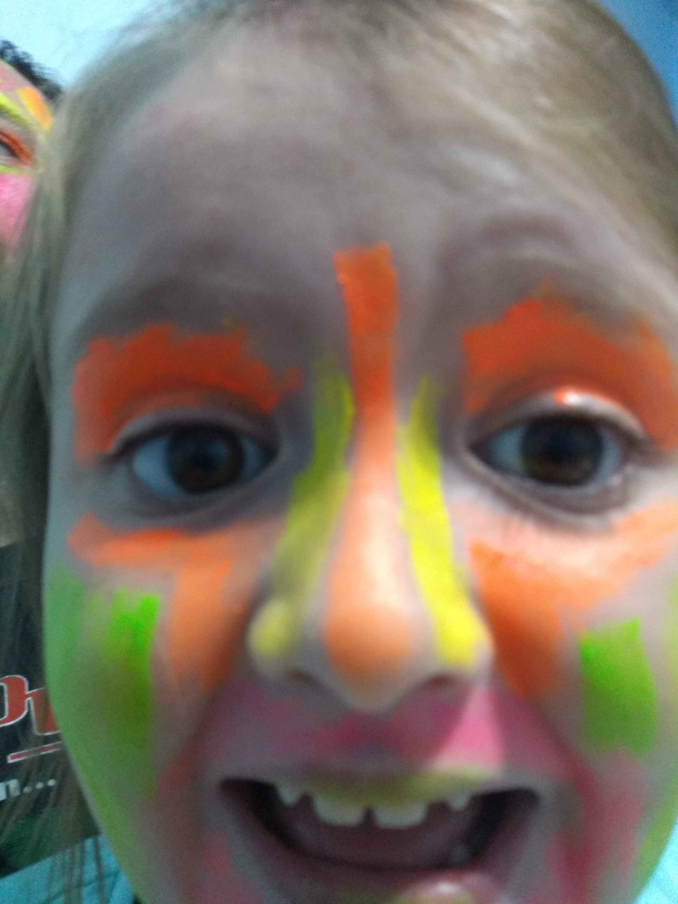

```{r setup, include=FALSE}
knitr::opts_chunk$set(echo = TRUE, message = FALSE, warning = FALSE, dpi = 200)
```

# Clustering

## El arte de ordenar el último cajón de la cocina

Los algoritmos de clustering en general buscan detectar grupos (clusters) entre los datos que reúnan dos características:

1.  Las características de los casos **dentro** del grupo son similares.
2.  Las características de los casos **fuera** del grupo son diferentes.

Hay dos grandes grupos de algoritmos de clustering.

-   De partición

-   Jerárquicos

En los **algoritmos supervisados**, los datos tienen que tener etiquetados, para que el algoritmo pueda aprender las clasificaciones, y luego detectar a qué grupos pertenecen los nuevos casos. Estos algoritmos se los usa para problemas de *regresión* y *clasificación*.

Por otro lado, tenemos los **algoritmos no supervisados**, que en donde nosotros no definimos la característica de cada grupo: por ejemplo en los algoritmos de *k-means,* le decimos al algoritmo cuántos grupos queremos, y el algoritmo se encarga de clasificarlos los casos en los grupos sin que nosotros tengamos más control sobre las definiciones de las características de cada cluster. Algunos de los algoritmos no supervisados permiten detectar novedades en los datos, fraudes, similitudes entre textos para clasificar de igual manera variantes de texto, etc..

## Tipos de algoritmos de clustering

### Métodos de partición

En los métodos de partición los datos se van a agrupar en una cantidad (indicada con la letra ***k***) de grupos. Los grupos tienen que cumplir con estas condiciones:

-   Cada grupo tiene que tener un objeto.

-   Y cada objeto tiene que pertenecer exactamente a un sólo grupo.

### Métodos jerárquicos

Dentro de los métodos jerárquicos, tenemos dos tipos esenciales de algoritmos:

Los algoritmos **aglomerativos** que empiezan con una cantidad n de clusters de una observación cada uno, y luego se combinan dos grupos hasta terminar con un solo cluster con n observaciones (sí, como el anillo de Sauron más o menos).

Y por otro lado tenemos los métodos **divisorios** que *comienzan con un sólo cluster* de n observaciones y en cada paso se divide un grupo en dos hasta tener n clusters con una observación cada uno. Es prácticamente la estrategia inversa a la anterior.

Hoy nos centraremos en los primeros.

# k-means

En figuras geométricas simétricas, es muy sencillo definir el centro.

{width="232"}


Ahora, en figuras geométricas complejas, como puede ser los límites de una provincia o de un barrio, encontrar el centro es un problema.


```{r}

library(tidyverse)
library(sf)

comunas <- st_read('https://bitsandbricks.github.io/data/CABA_comunas.geojson')

comuna_2 <- comunas %>% 
  filter(comunas == 2)

comuna_2 <- comuna_2 %>% 
  st_centroid()

ggplot()+
  geom_sf(data=comunas, color="gray")+
  geom_sf(data=comuna_2, color="red", shape=4, stroke=2, size=1) +
  theme_minimal()

```

Con los clusters en k-means vamos a hacer algo análogo. Vamos a tener una nube de puntos, con algunas características, vamos a indicar la cantidad de grupos que queremos (el *k*), y el algoritmo va a buscar, en función de la distribución de los datos un punto medio de referencia para cada cluster.

Ese "punto medio", es lo que se conoce como **centroide**.

Internamente la secuencia es la siguiente:

1.  Definimos la cantidad de clusters (el k).
2.  El algoritmo define un centro aleatorio para los puntos.
3.  Para cada punto de los datos, define cuál es el *centro* que está más cerca y cada centro se "apropia" de un set de puntos de datos.
4.  Para cada centro y los datos apropiados, define un centroide.

{width="450"}

# A practicar!

## Sysarmy

Vamos a usar una versión de la encuesta de Sysarmy y repasar lo que vimos en la sesión 9 con Pablo Casas.

```{r}
library(funModeling)
library(DataExplorer)

# Cargamos el archivo
sysarmy <- read_delim("Datasets/sysarmy_clean.csv", delim = ";")

status(sysarmy)

```

Luego, definimos con qué variables nos vamos a quedar:

```{r}
# Seleccionamos variables categóricas
variables_c <- status(sysarmy) %>% 
  filter(type=="character" & unique<10) %>% 
  pull(variable)


variables_n <- status(sysarmy) %>% 
  filter(type=="numeric") %>% 
  pull(variable)

# Nos quedamos con estas variables candidatas
v_sel <- c("X.Tenés.guardias.", 
           "X.Programás.como.hobbie.", 
           "X.Tuviste.ajustes.por.inflación.en.2019.", 
           "Salario.mensual.BRUTO..en.tu.moneda.local.",
           "Tengo")

```

De acá en más, copiamos descaradamente el script de Pablo Casas de la sesión 9 del Club. Primero creamos un dataframe con las variables seleccionadas

```{r}
# Copiado descaradamente del script de Pablo Casas
d5=select(sysarmy, all_of(v_sel))

status(d5)

```

Luego, transformamos las variables, a variables de tipo **dummy**. Esto crea para cada una de las categorías de la variable categórica, una columna nueva con un 1 o un 0 según corresponda.

```{r}
d5_dum=dummify(d5)  # variables dummy o one hot encoding

glimpse(d5_dum)
```

Escalamos los datos para que funcione mejor el algoritmo de k-means y creamos los clusters

```{r}
# Escalar para kmeans!
d6=scale(d5_dum)

head(d6)

fit_cluster=kmeans(d6, 3)
```

Incorporamos los clusters al dataframe

```{r}
# Copia!
d_fit=d5_dum

# Asignacion del cluster
d_fit$cluster=fit_cluster$cluster
```

Y visualizamos los resultados

```{r}
# Visualizando. Vamos a contar una historia!!
coord_plot(data=d_fit, 
           group_var="cluster", 
           group_func=mean, 
           print_table=TRUE)


```

Hasta los comentarios del script le robamos a Pablo.

## Un uso copado: paleta de colores

[Ariadna Angulo-Brunet](https://www.linkedin.com/in/ariadna-angulo-brunet-98ba877a/), una psicóloga catalana, para la iniciativa \#30díasdegráficos de la comunidad hispanoparlante de R publicó en su [cuenta de Twitter](https://twitter.com/AnguloBrunet/status/1263365115660898304?s=20) una serie de gráficos con una paleta de colores usando fotos de sus vacaciones. Su [repo en github](https://github.com/AnguloB/datosdemiercoles/tree/master/00_30diasDeGraficos) no tiene desperdicio.

Inspirado en su trabajo hice lo mismo usando una foto de mi hija.

{width="400"}

Vayamos por partes con el código

```{r}
library(jpeg)
library(scales)
library(extrafont) # la primera vez ejecutar font_import()

loadfonts(quiet = TRUE)
font <- "Ubuntu Mono"


foto <- readJPEG("Archivos/beauty.jpg")

class(foto)
```

La foto está cargada en un tipo de objeto llamado **array**. Este es un tipo de vector multidimensional, es decir que a diferencia de un vector común (que solo tiene una dimensión, los arrays pueden tener [varias dimensiones](https://bookdown.org/jboscomendoza/r-principiantes4/matrices-y-arrays.html). En nuestro caso, tiene 3.

```{r}
foto_dim <- dim(foto)
foto_dim

```

Luego convertimos el array en un dataframe.

```{r}
foto_rgb <- data.frame(
  x = rep(1:foto_dim[2], each = foto_dim[1]),
  y = rep(foto_dim[1]:1, foto_dim[2]),
  R = as.vector(foto[,,1]), #slicing our array into three
  G = as.vector(foto[,,2]),
  B = as.vector(foto[,,3]))

head(foto_rgb)

summary(foto_rgb)

```

El siguiente paso es crear los clusters, vamos a definir 20 clusters diferentes (puede tardar unos segundos)

```{r}
foto_kmeans <- kmeans(foto_rgb[,c("R","G","B")], centers = 20, iter.max = 30)

str(foto_kmeans)
```

Finalmente tenemos una paleta de colores de la foto que podemos usar en cualquier gráfico.

```{r}
# La paleta de colores de la foto de mi hija
show_col(rgb(foto_kmeans$centers))
```

Y con esa paleta podemos crear un gráfico. Vamos a usar las columnas `Puesto` y `Sueldo_Bruto` para calcular el sueldo promedio de 20 posiciones. Así que nuestro primer paso es crear un dataframe con esas dos columnas, y luego filtrar las respuestas de 20 puestos con mayor cantidad de casos.

```{r}

analisis <- sysarmy %>%
  select(Trabajo.de, Salario.mensual.BRUTO..en.tu.moneda.local.) %>%
  rename(Puesto = Trabajo.de,
         Sueldo_Bruto = Salario.mensual.BRUTO..en.tu.moneda.local.)

top_20_puestos <- analisis %>%
  select(Puesto, Sueldo_Bruto) %>%
  group_by(Puesto) %>%
  tally(sort = TRUE) %>% 
  top_n(20) %>%
  select(Puesto)

top_20_puestos <- as.vector(top_20_puestos$Puesto)


```

Y ahora podemos hacer nuestro gráfico, usando la paleta de colores que acabamos de crear.

```{r dpi=300, fig.height=6}
analisis %>%
  filter(Puesto %in% top_20_puestos) %>%
  group_by(Puesto) %>%
  summarise(Sueldo_Promedio = mean(Sueldo_Bruto)) %>%
  ungroup() %>% 
  ggplot(aes(x = reorder(Puesto, Sueldo_Promedio), y = Sueldo_Promedio, fill = Puesto))+
  geom_col(position = "dodge") +
  scale_fill_manual(values = rgb(foto_kmeans$centers))+
  scale_y_continuous(labels = scales::comma_format(big.mark = ".", decimal.mark = ","))+
  coord_flip()+
  theme(panel.background = element_blank(),
        panel.grid.major.x = element_line(colour = "#D7DBDD"),
        text = element_text(family = "Ubuntu Mono")) +
  labs(title = "Sueldo bruto promedio por puesto (en AR$)",
       subtitle = "Fuente: Encuesta de Sueldos de Sysarmy",
       caption = "Club de R para RRHH",
       x = "",
       y = "")
```
