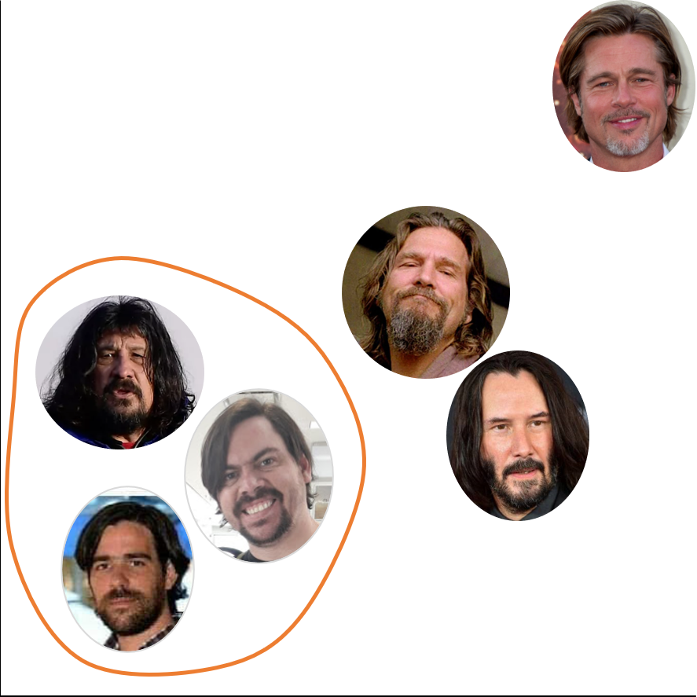
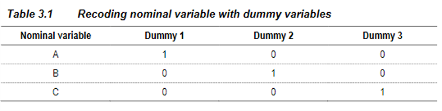
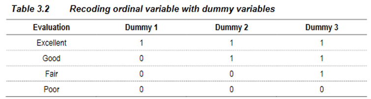

class: inverse, top, center
background-image: url(Archivos/CLUB_DE_R_Linkedin.png)

# Sesión 34 - Clustering Jerárquico


```{r setup, include=FALSE}
options(htmltools.dir.version = FALSE)
knitr::opts_chunk$set(echo = TRUE, message=FALSE, warning=FALSE)
```


---
class: inverse, middle, right

### Contacto


`r icon::fa("linkedin-in")` [Sergio Garcia Mora](https://www.linkedin.com/in/sergiogarciamora/)

`r icon::fa("twitter")` [Redes Sociales](https://linktr.ee/r4hrclub)

`r icon::fa("link")` [Información del Club de R para RRHH](https://r4hr.club)

---
# Clustering
## *El arte de ordenar el último cajón de la cocina*

.pull-left[
En la sesión pasada vimos una introducción al tema de clustering que es una técnica para agrupar observaciones, y que cumple con las siguientes características:

* Los elementos dentro del grupo tienen características similares entre sí.
* Las caracterísctas de los elementos de distintos grupos son muy diferentes.

Vimos un método llamado **k-means** que es un *método de partición*, porque divide al dataset en tantos grupos o clusters (k) como le indiquemos.
]

.pull-right[

]

---
## Otros métodos de partición
## k-nn: k nearest neighbours

Otro método de particición muy conocido es el "vecinos más cercanos", o k-nn, que determina el cluster al que pertenece una observación en función de los elementos que estén más cerca de ese elemento.

--

<br><br>

.center[]


---
class: inverse
# Distancias
<br>
.center[]

---
# Distancias

Para comprender mejor el tema de clustering, y la forma en la que los algoritmos hacen las agrupaciones hay que hablar de distancias.

En variables continuas podemos encontrar **medidas de disimilaridad** que son formas de medir qué tan lejos están un punto de otro. Acá nos encontramos por ejemplo con:

--

* La **distancia euclideana**: que no es ni más ni menos que aplicar el Teorema de Pitágoras.
* La **distancia "Manhattan"**: que incorpora los caminos posibles, por ejemplo en una ciudad.

.center[]

--

Por otra parte, una medida de similitud es por ejemplo la *correlación*.

---
# Clustering Jerárquico

Los algoritmos de clustering jerárquico las clases están anidadas. Como vimos en la sesión anterior, tenemos dos tipos de clustering jerárquicos, los algoritmos de clustering jerárquico se clasifican en dos tipos:

1. **Métodos ascendentes o aglomerativos**
2. **Métodos descendentes o de difusión**

--

### Ventajas de los métodos de clasificación jerárquicos

* Sugiere el número de clusters.
* Establece una jerarquía de clusters.
* El dendograma permite la visualización del proceso y la solución final del problema planteado.

--

### Desventajas de los métodos de clasificación jerárquicos

* Resulta costoso en grandes bases de datos.
* Es lento

---
# Clustering Jerárquico

Los métodos jerárquicos tienen la particularidad que un cluster puede estar contenido dentro de otro, pero no permiten otro tipo de superposición entre sí. Por ejemplo:

--

* Las frutas, se pueden anidar en el cluster de vegetales, pero no con el de verduras.

--

* Podemos tener un cluster de empleados de RRHH, y luego subgrupos de reclutamiento y de compensaciones por ejemplo.

--

La forma de visualizar este tipo de método de clustering es con **dendogramas**.

---
# Dendogramas

Los *dendogramas* son árboles de dos dimensiones en el que se pueden observar las uniones y/o divisiones que se van realizando en cada nivel del proceso de construcción de los conglomerados.

.pull-left[
Las ramas se unen en un nodo cuya posición a lo largo del eje de distancias indica el nivel en el cual la fusión ocurre. El nodo donde todas las entidades forman un único conglomerado, se denomina *nodo raíz*.

Un dendograma es una representación gráfica en forma de árbol que resume el proceso de agrupación en un análisis de clusters. Los objetos similares se conectan mediante enlaces cuya posición en el diagrama está determinada por el nivel de similitud/disimilitud entre los objetos.
]

.pull-right[

]

---
# Pasos de la clasificación jerárquica

Estos son los pasos recomendados para construir clusters jerárquicos:

1. Seleccionar los datos y variables. Si vamos a usar variables numéricas, es importante estandarizarlas, o tipificarlas para obtener mejores resultados. Si son variables de texto hay que decidir si se transforman a numéricas.

--

2. Elegir un método de distancia (a los fines de la charla de hoy, usaremos la distancia euclídea).

--

3. Buscamos los clusters más similares.

--

4. Juntamos estos dos clusters en un nuevo cluster que tenga al menos 2 objetos, de forma que el número de clusters decrece en una unidad.

--

5. Seleccionamos la técnica de cluster y calculamos la distancia entre este nuevo cluster y el resto.

--

6. Repetimos desde el paso 3 hasta que todos los objetos estén en un único cluster.

--

7. Interpretar los resultados.

---
## Paréntesis: Como transformar una variable de texto en numérica.

A las variables de texto las podemos convertir en numéricas, creando tantas columnas como cantidad de valores distintos tenga la variable de texto. Veamos los casos para variables *nominales* y *ordinales*.

### Variables nominales



### Variables ordinales



---
class: inverse, center, middle
## A Marcela Clusterboer le gustó esta clase... y ustedes?


---
class: center, middle
# FELIZ NAVIDAD Y QUE TENGAN UN GRAN 2021!!!


---
# Fuentes

[Classification Based onSupervised Clustering withApplication to Juvenile Idiopathic Arthritis](http://stat.sfu.ca/content/dam/sfu/stat/alumnitheses/2013/YangYuanyu_Thesis.pdf) de Yuanyu Yang

Material de Maestría de Data Mining UBA de la Dra. Débora Chan

---
class: inverse, center, bottom

Presentación realizada con el paquete [Xaringan](https://github.com/yihui/xaringan) desarrollado por Yihui Xie.

Gracias a [Patricia Loto](https://twitter.com/patriloto) por compartir el [tutorial](https://twitter.com/patriloto/status/1260822644590608391?s=20)