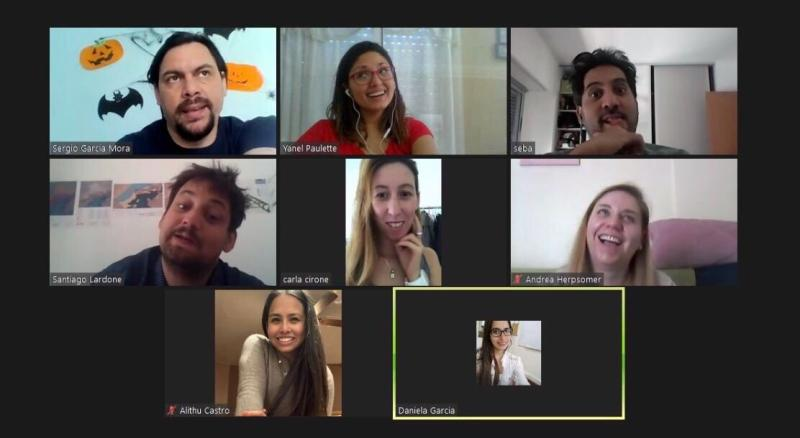
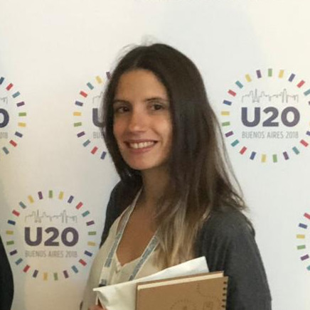
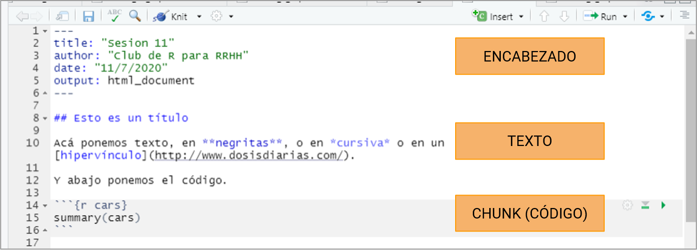
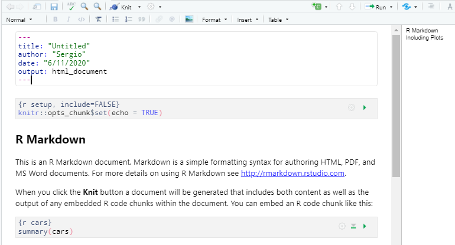
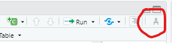
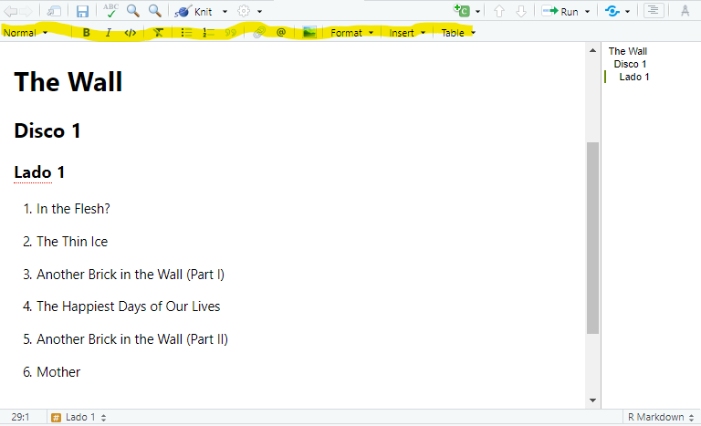
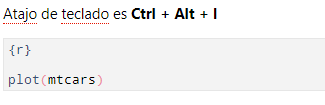
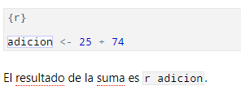
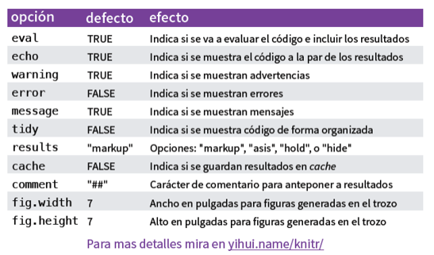

class: inverse, top, center
background-image: url(Archivos/kiwi-fondo.png)
background-size: cover

```{r setup, include=FALSE}
knitr::opts_chunk$set(fig.retina = 3, warning = FALSE, message = FALSE)
```


```{r metathis, echo=FALSE}
library(metathis)
meta() %>%
  meta_name("github-repo" = "r4hr/club_de_r") %>% 
  meta_social(
    title = "Sesión abierta Nov. 2020 - Introducción a RMarkdown",
    description = paste(
      "Una introducción a cómo realizar informes con la versión preview de RStudio 1.4",
      "por el Club de R para RRHH"),
    url = "https://clubder-rmarkdown.netlify.app/",
    image = "https://github.com/r4hr/club_de_r/blob/master/Archivos/kiwi-fondo.png",
    image_alt = paste(
      "Inttroducción a RMarkdown con RStudio 1.4", 
      "Desarrollada por el Club de R para RRHH"
    ),
    og_type = "website",
    og_author = "Sergio Garcia Mora",
    twitter_card_type = "summary_large_image",
    twitter_creator = "@sergiogarciamor",
    twitter_site = "@club_rrhh"
  )
```

```{r xaringanExtra-share-again, echo=FALSE}
xaringanExtra::use_share_again()
```


???

Image credit: [Designed by Freepik]("http://www.freepik.com")

---
# Quiénes somos

El [Club de R para RRHH](https://r4hr.club) es una comunidad de aprendizaje de programación en R destinada para las personas que trabajan en Recursos Humanos de habla hispana.

Nuestro objetivo es acercar el mundo de ciencias de datos a nuestra profesión, adaptando el contenido a nuestros skills y conocimientos, y también siempre que podemos, usando datos relacionados con la gestión de personas, y en castellano, para hacer más accesible el aprendizaje.

Este es un proyecto que ideó [Sergio García Mora](https://www.linkedin.com/in/sergiogarciamora/), y que reúne a gente de Argentina, Perú, Chile, Paraguay, Uruguay, Panamá, USA, Francia, y cada vez más y más profesionales de distintas latitudes se unen y contribuyen al proyecto.

Para más información sobre el Club de R leé [este post](https://r4hr.club/2020/09/23/el-club-de-r-para-rrhh/), o escribinos a [info@r4hr.club](mailto:info@r4hr.club).

---
# Quiénes somos
## La encuesta KIWI `r emo::ji("kiwi")` de Sueldos de RRHH para LATAM

Uno de los problemas en el aprendizaje de People Analytics es la falta de datasets para practicar, así que una decisión que tomamos fue el de generar nuestro propio dataset y de abrirlo para toda la comunidad.

Para hacer esta encuesta nos "inspiramos" en [SysArmy](https://sysarmy.com/blog/), una comunidad para las personas que trabajan en tecnología que además de organizar uno de los eventos más importantes de tecnología de Argentina, **Nerdearla**, y que también organizan una encuesta salarial dos veces por año.

Estas son las motivaciones detrás de esta encuesta. Tener nuestro propio dataset, compartir los resultados y los datos, para que todos los entusiastas de RRHH y de los datos cuenten con una fuente de datos para practicar.

> Si querés conocer la historia detrás del nombre de la encuesta, la podés [conocer aquí](https://r4hr.club/why-kiwi/).

---
background-color: "#5D6D7E" 
# Quiénes somos
## Organizadores
.pull-left[
`r emo::ji("male_detective")` [Adrián Quiroga](https://www.linkedin.com/in/adrian-quiroga-ab57424b/) 

`r emo::ji("woman_technologist")` [Alithu Castro](https://www.linkedin.com/in/alithucastro/)

`r emo::ji("woman_student")` [Andrea Herpsomer](https://www.linkedin.com/in/andreaherpsomer/)

`r emo::ji("woman_artist")` [Carla Cirone](https://www.linkedin.com/in/carla-cirone-0566b095/)

`r emo::ji("woman_technologist")` [Daniela García](https://www.linkedin.com/in/claudia-daniela-garcia-138b1a14b/)

`r emo::ji("woman_astronaut")` [Lucía Huilén Gómez](https://www.linkedin.com/in/luc%C3%ADa-huil%C3%A9n-g%C3%B3mez-93565276/)

`r emo::ji("man_singer")` [Santiago Lardone Quinodoz](https://www.linkedin.com/in/santiago-lardone-quinodoz-978588167/)

`r emo::ji("snake")` [Sebastián Lombraña](https://www.linkedin.com/in/santiago-lardone-quinodoz-978588167/)

`r emo::ji("metal")` [Sergio García Mora](https://www.linkedin.com/in/sergiogarciamora/)

`r emo::ji("woman_teacher")` [Yanel Paulette](https://www.linkedin.com/in/yanelpaulette/)
]

.pull-right[]
---
# Invitados

Habitualmente las presentaciones del Club las hacemos nosotros. Pero una vez al mes, invitamos a un Data Scientist que nos hable sobre un tema de su especialidad. Así hemos tenido a gente como: 


--

.pull-left[

 [Pablo Tiscornia](https://www.linkedin.com/in/ptiscornia/): Paquete EPH.

 [Pablo Casas](https://www.linkedin.com/in/pcasas/): Análisis Exploratorio de Datos con `funModeling`.

 [Ana Laura Diedrichs](https://www.linkedin.com/in/ana-laura-diedrichs-47038415/): Introducción a control de versiones con Git.

 [Hernán Escudero](https://www.linkedin.com/in/hernanescudero/): Aplicaciones interactivas con `Shiny`.

 [Ángeles Scetta](https://www.linkedin.com/in/mar%C3%ADa-de-los-%C3%A1ngeles-scetta-b7b82a80/): Análisis de datos geoespaciales en R.  
]

--

.pull-right[

### Y nuestros créditos "locales" `r emo::ji("applause")`

 [Alithu Castro](https://www.linkedin.com/in/alithucastro/): Estadística y notebooks de R.

 [Luis Grau](https://www.linkedin.com/in/luis-grau-r-212b3a9/): Formato de tablas con `kable`.

]

---
# Invitados
## Suscripción al Club de R para RRHH

Todos los sábados de 10:00 a 11:30 hs. nos reunimos para revisar paquetes, tipos de análisis, proyectos, etc.. Mayormente utilizamos datos de RRHH (salvo los invitados) y en castellano para que sólo nos preocupemos por entender R, y no tener que intentar comprender datos extraños.

--

La suscripción al Club tiene costo, que dedicamos principalmente a pagarlo los honorarios a los invitados, y a las licencias de algunas plataformas, pero desde **noviembre, la sesión del primer sábado de cada mes será abierta y gratuita** `r emo::ji("party")`.

.right[]

---
class: inverse center middle
# Empecemos!


---
# RMarkdown

**RMarkdown** es un paquete de R que ya viene incluido en RStudio que permite hacer:

* Informes en HTML
* Informes en PDF/Word
* Notebooks
* Emails
* Presentaciones
* Libros
* Blogs
* Dashboards

.right[]
---
# RMarkdown

Markdown es un lenguaje que existe antes de R, y que nació para facilitar la conversión de texto en código… usando código.

--

Al principio es complejo porque uno no edita el texto con un ícono como en Word o en Powerpoint, y al igual que R tiene una curva de aprendizaje que demanda dedicación, pero una vez que le agarrás la mano es muy difícil soltarlo.

--

En R, permite generar documentos que incluyen el código (visible o no) y la salida de resultados, lo cual a la hora de armar un informe o una presentación con datos y/o gráficos, termina ahorrando tiempo.

.right[]
---
# RMarkdown
## Ventajas

* Correcciones.
* Evito errores por copypastear mal.
* Ahorro tiempo.
* Puedo compartir el análisis.
* Automatizar informes y pasos repetitivos.
* No sólo sirve para R.

.right[]
---
# RMarkdown
## Componentes

RMarkdown tiene 3 componentes principales:

1. **Encabezado**: Contiene metadata del documento (qué tipo de documento va a ser).

--

2. **Texto**: Eso.

--

3. **Código**: Que se vuelca en los *chunks* o bloques de código.

--

.center[]

---
# RMarkdown
## Componentes en versión RStudio 1.4

<br>
.center[]

---
# RMarkdown
## Tipos de documentos

Estos son los tipos de documentos que podemos generar en RMarkdown

.pull-left[
### Documentos

* github_document
* html_document
* latex_document
* md_document
* odt_document
* pdf_document
* rtf_document
* word_document
]

--

.pull-right[
### Presentaciones
* beamer_presentation
* ioslides_presentation
* powerpoint_presentation
* slidy_presentation

Si bien no es estrictamente de RMarkdown pero también está el paquete **Xaringan** (el que uso en las presentaciones habitualmente).
]
---
class: inverse
# Cheatsheet 
## (machete, cola, trencito, copiatín, plage, batería, torpedo, chuleta, etc.)

Los *cheatsheet* son documentos con resúmenes de las principales funciones de los paquetes más utilizados.

La comunidad de R de hispanoamérica ha traducido unos cuantos, gracias a quienes podemos contar hoy con un cheatsheet en [castellano](https://drive.google.com/file/d/169ceviH1YChh4cALSGCFkSmAvnFoQ0aJ/view?usp=sharing).

También contamos con un documento en [inglés](https://rstudio.com/wp-content/uploads/2015/03/rmarkdown-reference.pdf?_ga=2.143643697.583415055.1594393652-581652334.1578054321). 

.left[]

---
# El encabezado

El *encabezado* de un documento de RMarkdown contiene la metadata del archivo:

```{r yaml, eval=FALSE}
---
title: "Untitled"
author: "Sergio"
date: "6/11/2020"
output: html_document
---

```

---
# El encabezado

.left-column[
La lógica del encabezado (en adelante YAML) se rige por el CSS (Cascading Style Sheets) que es el lenguaje de estilos de programación en HTML.

Lo importante es respetar los espacios y sangrías.

]

.right-column[
```{r yaml2, eval=FALSE}
---
title: "Sesión 28 - Introducción a RMarkdown"
subtitle: "Club de R para RRHH"
author: "Sergio de Data 4HR"
date: "Noviembre 2020"
output: 
  html_document:
    theme: spacelab
    highlight: pygments
    toc: true
    toc_float: true
    code_download: true
    code_folding: hide
---
```

]


---
# Editar texto

En las versiones *"clásicas"* de RMarkdown, para controlar la estética del texto podíamos usar algunos símbolos.

`# Título`
`## Subtítulo`

Un asterisco o guión bajo para poner texto en *cursiva*. Ej: `*sobresaliente*`.

--

Dos asteriscos o guiones bajos para poner texto en **negrita**. Ej: `**sobresaliente**`.

--

Por ejemplo

`# Título`

Texto libre

`*  Ítem 1`

`*  Ítem 2`

`*  Ítem 3`

`Texto en **negrita**. Texto en *cursiva*`.

---
background-image: url(https://i0.wp.com/www.scienceofnoise.net/wp-content/uploads/2019/12/pink-floyd-the-wall-.jpg)
background-size: contain
# Ejemplo

---
# Ejemplo

Copien y peguen esto en el documento de RMarkdown

`# The Wall`

`## Disco 1`

`### Lado 1`

1. In the Flesh?
2. The Thin Ice
3. Another Brick in the Wall (Part I)
4. The Happiest Days of Our Lives
5. Another Brick in the Wall (Part II)
6. Mother

---
# Ejemplo
## La versión preview de RStudio 1.4

Si activamos el **compás** van a poder ver que aparece una **barra de edición** que es parte de la versión preview de RStudio 1.4 y que no está en las versiones anteriores del software.



.center[]

---
# Bloques de código

La forma más rápida de crear un bloque de código es usándo las teclas *Ctrl + Alt + I*.



--

Y podemos usar los objetos que creamos dentro de los bloques de código para automatizar respuestas en el texto libre.



---
# Bloques de código
## Opciones

Podemos elegir varias opciones para hacer visible o no el código, definir si queremos mostrar o no los mensajes de error, o incluso si queremos correr el código o sólo mostrarlo sin que haga nada.

Estas opciones las definimos en cada bloque.

.center[]

---
# Encabezado
## Temas y estilos


```{r eval=FALSE}
---
title: "Habits"
output:
  html_document:
    theme: united
    highlight: tango
---
```

Recuerden poner:

* La sangría
* Los dos puntos al final de `html_document`.
* La sangría de las opciones como `theme` por ejemplo.

---
# Encabezado
## Temas y estilos

.pull-left[
### Estilos predefinidos

* cerulean, 
* journal, 
* flatly, 
* darkly, 
* readable, 
* spacelab, 
* united, 
* cosmo, 
* lumen, 
* paper, 
* sandstone, 
* simplex, 
* yeti
]

.pull-right[
### Code Highlight
`highlight` establece el estilo para resaltar los bloques en el documento. Las opciones predefinidas son:

* default, 
* tango, 
* pygments, 
* kate, 
* monochrome, 
* espresso, 
* zenburn, 
* haddock, 
* breezedark, 
* textmate
]

---
class: inverse center middle
# Empecemos!


---
class: middle
# Muchas gracias!
.pull-left[

]

.pull-right[
Si te gustó esta sesión podés suscribirte escribiéndonos a [info@r4hr.club](mailto:info@r4hr.club) y acceder a todas las sesiones pasadas, y participar de las próximas sesiones con especialistas.

Recuerden compartir sus capturas de pantalla y sensaciones con los hashtags:

* ### #R4HR
* ### #data4hr
* ### #PeopleAnalytics
* ### #RStats_ES
* ### #BetterWithData
]
---
class: inverse, center, middle

## Seguinos en nuestras redes
### [link.tree/r4hrclub](https://www.linktr.ee/r4hrclub) `r emo::ji("satellite")`


---

# Paquetes utilizados

* [ggplot2](https://ggplot2.tidyverse.org): H. Wickham. ggplot2: Elegant Graphics for Data Analysis. Springer-Verlag New York, 2016.
* [tidyverse](https://doi.org/10.21105/joss.01686): Wickham et al., (2019). Welcome to the tidyverse. Journal of Open Source Software, 4(43), 1686
* [funModeling](https://CRAN.R-project.org/package=funModeling): Pablo Casas (2020). funModeling: Exploratory Data Analysis and Data Preparation Tool-Box. R package version 1.9.4.
* [gargle](https://CRAN.R-project.org/package=gargle): Jennifer Bryan, Craig Citro and Hadley Wickham (2020). gargle: Utilities for Working with Google APIs. R package version 0.5.0.
* [googlesheets4](https://CRAN.R-project.org/package=googlesheets4): Jennifer Bryan (2020). googlesheets4: Access Google Sheets using the Sheets API V4. R package version 0.2.0.
* [gt](https://CRAN.R-project.org/package=gt): Richard Iannone, Joe Cheng and Barret Schloerke (2020). gt: Easily Create Presentation-Ready Display Tables. R package version 0.2.2.
* [scales](https://CRAN.R-project.org/package=scales): Hadley Wickham and Dana Seidel (2020). scales: Scale Functions for Visualization. R package version 1.1.1.

---
class: inverse, center, bottom

# `r fontawesome::fa(name = "github-alt", fill = "white")`
[Repo](https://github.com/r4hr/club_de_r/blob/master/Sesion_28_Intro_RMarkdown_vfinal.Rmd)

Presentación realizada con el paquete [Xaringan](https://github.com/yihui/xaringan) desarrollado por Yihui Xie.

Gracias a [Patricia Loto](https://twitter.com/patriloto) por compartir el [tutorial](https://twitter.com/patriloto/status/1260822644590608391?s=20)